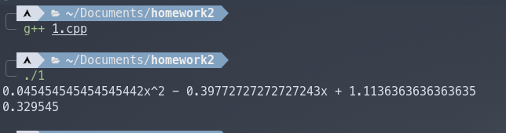
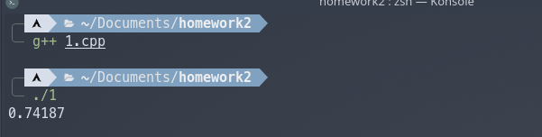
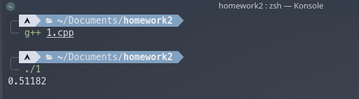
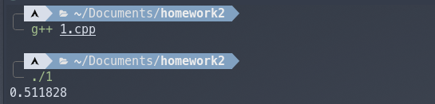
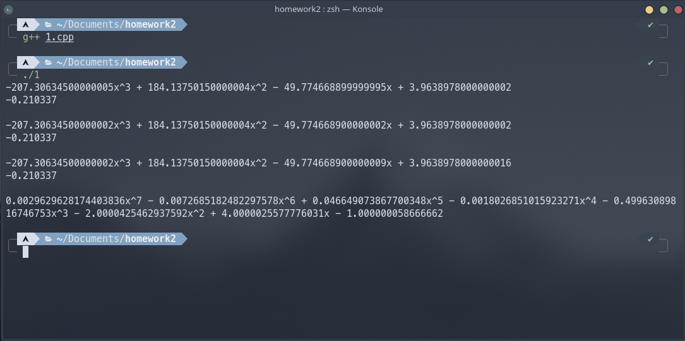

### 第三章作业


OS: 						Arch Linux x86_64 
Kernel: 				 5.16.16-arch1-1
g++-version:        11.2.0

运行：使用了boost库，如要运行需先安装boost：https://www.boost.org，测试所需函数附在poly.h中。

#### 拉格朗日插值

```c++
template<typename T>
polynomial<T> lagrange_inter_step(std::vector<T> &&vec,int &&k){
    polynomial<T> res={{1}};
    int num=0;
    T k_val=vec[k];
    for(auto i=vec.begin();i!=vec.end();i++){
        if(num!=k){
            T k_val_step=k_val-(*i);
            res=res*polynomial<T>{(*i)*(-1)/k_val_step,1/k_val_step};
        }
        else{res=res;}
        num++;
    }
    return res;
}

template<typename T>
polynomial<T> lagrange_inter(std::vector<T> &&vec,std::vector<T> &&val){
    polynomial<T> res={{0}};
    for(int i=0;i<vec.size();i++){
        polynomial<T> temp=lagrange_inter_step(std::move(vec),std::move(i));
        res=res+temp*val[i];
    }
    return res;
}

double fun_test(double &&val){
    return 1/val;
}
```

对于函数
$$
\frac{1}{x}
$$
进行测试：

```C++
    std::vector<double> vec1{2,2.75,4};
    std::vector<double> vec2{fun_test(2),fun_test(2.75),fun_test(4)};
    polynomial<double> poly=lagrange_inter(std::move(vec1),std::move(vec2));
    cout<<formula_format(poly)<<endl;
    cout<<eva_poly(std::move(poly.data()),3.0)<<endl;
```



这与书中example2中结果一致。

#### Neville方法

```c++
template<typename T>
polynomial<T> neville_inter(std::vector<T> &&vec,std::vector<T> &&val){
    typename std::vector<std::vector<polynomial<T>>> Q_vec;
    for(int i=0;i<vec.size();i++){
        polynomial<T> Q_i0={{val[i]}};
        std::vector<polynomial<T>> Q_i;
        Q_i.push_back(std::move(Q_i0));
        Q_vec.push_back(std::move(Q_i));
    }
    for(int i=1;i<vec.size();i++){
        for(int j=1;j<=i;j++){
            polynomial<T> q_ij_1={{-vec[i-j],1}};
            polynomial<T> q_i_1_j_1={{-vec[i],1}};
            polynomial<T> dev={{vec[i]-vec[i-j]}};
            polynomial<T> Q_ij_=(q_ij_1*Q_vec[i][j-1])-(q_i_1_j_1*Q_vec[i-1][j-1]);
            polynomial<T> Q_ij=Q_ij_/dev;
            Q_vec[i].push_back(Q_ij);
        }
    }
    return Q_vec[vec.size()-1][vec.size()-1];
}

```

对于函数
$$
\ln(x)
$$
进行测试：

```C++
    std::vector<double> vec11{2.0,2.2,2.3};
    std::vector<double> vec12{std::log(2.0),std::log(2.2),std::log(2.3)};
    polynomial<double> pol1=neville_inter(std::move(vec11),std::move(vec12));
    cout<<eva_poly(std::move(pol1.data()),2.1)<<endl;
```



这与书中example3结果一致(STL中log函数默认底为 $e$ )

#### Divided-Difference 

```c++
template<typename T>
polynomial<T> newton_inter(std::vector<T> &&vec,std::vector<T> &&val){
    typename std::vector<std::vector<T>> T_vec;
    for(int i=0;i<vec.size();i++){
        std::vector<T> T_i;
        T_i.push_back(val[i]);
        T_vec.push_back(std::move(T_i));
    }
    for(int i=1;i<vec.size();i++){
        for(int j=1;j<=i;j++){
            T num=(T_vec[i][j-1]-T_vec[i-1][j-1])/(vec[i]-vec[i-j]);
            T_vec[i].push_back(num);
        }
    }
    polynomial<T> res={{T_vec[0][0]}};
    for(int i=1;i<vec.size();i++){
        polynomial<T> po_i={{T_vec[i][i]}};
        for(int j=0;j<=i-1;j++){
            polynomial<T> temp={{-vec[j],1}};
            po_i=po_i*temp;
        }
        res=res+po_i;
    }
    return res;
}
```

对于Example 1中的数据进行测试

```C++
    std::vector<double> vec21{1.0,1.3,1.6,1.9,2.2};
    std::vector<double> vec22{0.7651977,0.6200860,0.4554022,0.2818186,0.1103623};
    polynomial<double> pol2=newton_inter(std::move(vec21),std::move(vec22));
    cout<<eva_poly(std::move(pol2.data()),1.5)<<endl;
```



与书中结果一致

#### Hermite多项式

```C++
template<typename T>
polynomial<T> hermite_inter(std::vector<T> &&x,std::vector<T> &&fx,std::vector<T> &&fdx){
    typename std::vector<std::vector<T>> Q;
    std::vector<T> Z;
    for(int i=0;i<x.size();i++){
        Z.push_back(x[i]);
        Z.push_back(x[i]);
        std::vector<T> Q_2i;
        std::vector<T> Q_2i1;
        Q_2i.push_back(fx[i]);
        Q_2i1.push_back(fx[i]);
        Q_2i1.push_back(fdx[i]);
        if(i!=0){
            T num=(fx[i]-Q[2*i-1][0])/(x[i]-Z[2*i-1]);
            Q_2i.push_back(num);
        }
        Q.push_back(std::move(Q_2i));
        Q.push_back(std::move(Q_2i1));
    }
    for(int i=2;i<2*x.size();i++){
        for(int j=2;j<=i;j++){
            T num=(Q[i][j-1]-Q[i-1][j-1])/(Z[i]-Z[i-j]);
            Q[i].push_back(num);
        }
    }
    polynomial<T> res={{0}};
    polynomial<T> temp={{1}};
    for(int i=0;i<x.size();i++){
        res=res+Q[2*i][2*i]*temp;
        polynomial<T> t1={{-x[i],1}};
        temp=temp*t1;
        res=res+Q[2*i+1][2*i+1]*temp;
        temp=temp*t1;
    }
    return res;
}
```

对于书中example1中的数据进行测试

```C++
    std::vector<double> vec31={1.3,1.6,1.9};
    std::vector<double> vec32={0.6200860,0.4554022,0.2818186};
    std::vector<double> vec33={-0.5220232,-0.5698959,-0.5811571};
    polynomial<double> pol3=hermite_inter(std::move(vec31),std::move(vec32),std::move(vec33));
    cout<<eva_poly(std::move(pol3.data()),1.5)<<endl;
```



与书中结果一致。

对于题目进行计算：

```c++
    std::vector<double> pro1={0.1,0.2,0.3,0.4};
    std::vector<double> pro2={0.62049958,-0.28398668,0.00660095,0.24842440 };

    polynomial<double> ll1=lagrange_inter(std::move(pro1),std::move(pro2));
    cout<<formula_format(ll1)<<endl;
    cout<<eva_poly(std::move(ll1.data()),0.25)<<endl;
    cout<<" "<<endl;

    polynomial<double> nev1=neville_inter(std::move(pro1),std::move(pro2));
    cout<<formula_format(nev1)<<endl;
    cout<<eva_poly(std::move(nev1.data()),0.25)<<endl;
    cout<<" "<<endl;

    polynomial<double> new1=newton_inter(std::move(pro1),std::move(pro2));
    cout<<formula_format(new1)<<endl;
    cout<<eva_poly(std::move(new1.data()),0.25)<<endl;
    cout<<" "<<endl;

    std::vector<double> prob1={0.1,0.2,0.3,0.4};
    std::vector<double> prob2={-0.62049958,-0.28398668,0.00660095,0.24842440};
    std::vector<double> prob3={3.58502082,3.14033271,2.66668043,2.16529366};

    polynomial<double> he1=hermite_inter(std::move(prob1),std::move(prob2),std::move(prob3));
    cout<<formula_format(he1)<<endl;
```



（由于第十版书与第七版书第二题数据不一样，prob2中第二项差个负号，这里采取新版数据）。


注：

四个算法中原始的拉格朗日插值很容易并行计算，显然其对原始数据只进行只读操作，而且算法每一步仅依赖原始数据，例如下面开启了两个线程，如果对于较大数据，显然可以提高运行效率，同理，可以类似下面操作进行分片来开启任意多线程。(直到C++11才引入并发支持，所以如果要运行代码，需保证标准编译器支持C++11，代码在编译时使用的是C++17)

```C++
template<typename T>
polynomial<T> la_step_pal(std::vector<T> vec,std::vector<T> val,int beg,int end){
    polynomial<T> res={{0}};
    for(int i=beg;i<end;i++){
        polynomial<T> temp=lagrange_inter_step(std::move(vec),std::move(i));
        res=res+temp*val[i];
    }
    return res;
}

template<typename T>
polynomial<T> lagrange_inter_pal(std::vector<T> &&vec,std::vector<T> &&val){
    polynomial<T> res={{0}};
    int midsize=vec.size()/2;
    int si=vec.size();

    std::future<polynomial<T>> res1=std::async(la_step_pal<T>,vec,val,0,midsize);
    std::future<polynomial<T>> res2=std::async(la_step_pal<T>,vec,val,midsize,si);

    res=res1.get()+res2.get();
    return res;
}
```

当然，代码还可以进行优化，因为开启线程会锁住临界区(vec,val)，所以我使用了复制传参，如果数据较大会在复制数据上化时间，但由于临界区域仅进行只读操作，所以无需上锁，代码如下。

```C++
template<typename T>
polynomial<T> lagrange_inter_pal(std::vector<T> &&vec,std::vector<T> &&val){
    polynomial<T> res={{0}};
    int midsize=vec.size()/2;
    int si=vec.size();

    polynomial<T> res1ts={{0}};
    polynomial<T> res2ts={{0}};

    std::thread t1([&](){        
        for(int i=0;i<midsize;i++){
            polynomial<T> temp=lagrange_inter_step(std::move(vec),std::move(i));
            res1ts=res1ts+temp*val[i];
        }});
    t1.join();
    std::thread t2([&](){
        for(int i=midsize;i<si;i++){
            polynomial<T> temp=lagrange_inter_step(std::move(vec),std::move(i));
            res2ts=res2ts+temp*val[i];
        }});
    t2.join();
    res=res1ts+res2ts;
    return res;
}
```

其余几个算法由于后面步骤依赖先前步骤，所以可操作范围较小，需要仔细设计。

poly.h

```c++
#include <boost/math/tools/polynomial.hpp>
#include <boost/lexical_cast.hpp>
#include <boost/math/tools/assert.hpp>
#include <iostream>
#include <cmath>
#include <string>
#include <boost/math/tools/rational.hpp>
#include <vector>

using std::string;
using std::cout;
using std::endl;
using std::abs;
using std::pair;

using namespace boost::math;
using namespace boost::math::tools; 
using boost::lexical_cast;


template <typename T>
string sign_str(T const &x)
{
    return x < 0 ? "-" : "+";
}

template <typename T>
string inner_coefficient(T const &x)
{
    string result(" "+sign_str(x)+" ");
    if(abs(x) != T(1))
        result+=lexical_cast<string>(abs(x));
    return result;
}

template <typename T>
string formula_format(polynomial<T> const &a)
{
    string result;
    if(a.size()==0)
        result+=lexical_cast<string>(T(0));
    else
    {
        unsigned i=a.size()-1;
        if (a[i]<0){result+="-";}
        if (abs(a[i])!=T(1)){result+=lexical_cast<string>(abs(a[i]));}
        if (i>0)
        {
        result += "x";
            if (i>1){
                result+="^"+lexical_cast<string>(i);
                i--;
                for(;i!=1;i--)
                    if (a[i]){
                        result+=inner_coefficient(a[i])+"x^"+lexical_cast<string>(i);
                    }
                if(a[i]){result+=inner_coefficient(a[i])+"x";}
            }
        i--;
        if(a[i]){
            result+=" "+sign_str(a[i])+" "+lexical_cast<string>(abs(a[i]));
        }
        }
    }
    return result;
}   

template<typename T>
T eva_poly(std::vector<T> && v1,T &&val){
    T res=*v1.begin();
    int deg=1;
    for(auto i=v1.begin()+1;i!=v1.end();i++){
        res+=(*i)*pow(val,deg);
        deg++;
    }
    return res;
}

```

1.cpp：

```c++
#include "poly.h"
#include<future>
#include<thread>

template<typename T>
polynomial<T> lagrange_inter_step(std::vector<T> &&vec,int &&k){
    polynomial<T> res={{1}};
    int num=0;
    T k_val=vec[k];
    for(auto i=vec.begin();i!=vec.end();i++){
        if(num!=k){
            T k_val_step=k_val-(*i);
            res=res*polynomial<T>{(*i)*(-1)/k_val_step,1/k_val_step};
        }
        else{res=res;}
        num++;
    }
    return res;
}

template<typename T>
polynomial<T> lagrange_inter(std::vector<T> &&vec,std::vector<T> &&val){
    polynomial<T> res={{0}};
    for(int i=0;i<vec.size();i++){
        polynomial<T> temp=lagrange_inter_step(std::move(vec),std::move(i));
        res=res+temp*val[i];
    }
    return res;
}


double fun_test(double &&val){
    return 1/val;
}


template<typename T>
polynomial<T> neville_inter(std::vector<T> &&vec,std::vector<T> &&val){
    typename std::vector<std::vector<polynomial<T>>> Q_vec;
    for(int i=0;i<vec.size();i++){
        polynomial<T> Q_i0={{val[i]}};
        std::vector<polynomial<T>> Q_i;
        Q_i.push_back(std::move(Q_i0));
        Q_vec.push_back(std::move(Q_i));
    }
    for(int i=1;i<vec.size();i++){
        for(int j=1;j<=i;j++){
            polynomial<T> q_ij_1={{-vec[i-j],1}};
            polynomial<T> q_i_1_j_1={{-vec[i],1}};
            polynomial<T> dev={{vec[i]-vec[i-j]}};
            polynomial<T> Q_ij_=(q_ij_1*Q_vec[i][j-1])-(q_i_1_j_1*Q_vec[i-1][j-1]);
            polynomial<T> Q_ij=Q_ij_/dev;
            Q_vec[i].push_back(Q_ij);
        }
    }
    return Q_vec[vec.size()-1][vec.size()-1];
}


template<typename T>
polynomial<T> newton_inter(std::vector<T> &&vec,std::vector<T> &&val){
    typename std::vector<std::vector<T>> T_vec;
    for(int i=0;i<vec.size();i++){
        std::vector<T> T_i;
        T_i.push_back(val[i]);
        T_vec.push_back(std::move(T_i));
    }
    for(int i=1;i<vec.size();i++){
        for(int j=1;j<=i;j++){
            T num=(T_vec[i][j-1]-T_vec[i-1][j-1])/(vec[i]-vec[i-j]);
            T_vec[i].push_back(num);
        }
    }
    polynomial<T> res={{T_vec[0][0]}};
    for(int i=1;i<vec.size();i++){
        polynomial<T> po_i={{T_vec[i][i]}};
        for(int j=0;j<=i-1;j++){
            polynomial<T> temp={{-vec[j],1}};
            po_i=po_i*temp;
        }
        res=res+po_i;
    }
    return res;
}

template<typename T>
polynomial<T> hermite_inter(std::vector<T> &&x,std::vector<T> &&fx,std::vector<T> &&fdx){
    typename std::vector<std::vector<T>> Q;
    std::vector<T> Z;
    for(int i=0;i<x.size();i++){
        Z.push_back(x[i]);
        Z.push_back(x[i]);
        std::vector<T> Q_2i;
        std::vector<T> Q_2i1;
        Q_2i.push_back(fx[i]);
        Q_2i1.push_back(fx[i]);
        Q_2i1.push_back(fdx[i]);
        if(i!=0){
            T num=(fx[i]-Q[2*i-1][0])/(x[i]-Z[2*i-1]);
            Q_2i.push_back(num);
        }
        Q.push_back(std::move(Q_2i));
        Q.push_back(std::move(Q_2i1));
    }
    for(int i=2;i<2*x.size();i++){
        for(int j=2;j<=i;j++){
            T num=(Q[i][j-1]-Q[i-1][j-1])/(Z[i]-Z[i-j]);
            Q[i].push_back(num);
        }
    }
    polynomial<T> res={{0}};
    polynomial<T> temp={{1}};
    for(int i=0;i<x.size();i++){
        res=res+Q[2*i][2*i]*temp;
        polynomial<T> t1={{-x[i],1}};
        temp=temp*t1;
        res=res+Q[2*i+1][2*i+1]*temp;
        temp=temp*t1;
    }
    return res;
}


template<typename T>
polynomial<T> la_step_pal(std::vector<T> vec,std::vector<T> val,int beg,int end){
    polynomial<T> res={{0}};
    for(int i=beg;i<end;i++){
        polynomial<T> temp=lagrange_inter_step(std::move(vec),std::move(i));
        res=res+temp*val[i];
    }
    return res;
}


template<typename T>
polynomial<T> lagrange_inter_pal(std::vector<T> &&vec,std::vector<T> &&val){
    polynomial<T> res={{0}};
    int midsize=vec.size()/2;
    int si=vec.size();

    // std::future<polynomial<T>> res1=std::async(la_step_pal<T>,vec,val,0,midsize);
    // std::future<polynomial<T>> res2=std::async(la_step_pal<T>,vec,val,midsize,si);

    // res=res1.get()+res2.get();

    polynomial<T> res1ts={{0}};
    polynomial<T> res2ts={{0}};

    std::thread t1([&](){        
        for(int i=0;i<midsize;i++){
            polynomial<T> temp=lagrange_inter_step(std::move(vec),std::move(i));
            res1ts=res1ts+temp*val[i];
        }});
    t1.join();
    std::thread t2([&](){
        for(int i=midsize;i<si;i++){
            polynomial<T> temp=lagrange_inter_step(std::move(vec),std::move(i));
            res2ts=res2ts+temp*val[i];
        }});
    t2.join();
    res=res1ts+res2ts;
    return res;
}


int main()
{
    std::vector<double> vec1{2,2.75,4};
    std::vector<double> vec2{fun_test(2),fun_test(2.75),fun_test(4)};

    polynomial<double> poly=lagrange_inter(std::move(vec1),std::move(vec2));
    cout<<formula_format(poly)<<endl;
    cout<<eva_poly(std::move(poly.data()),3.0)<<endl;

    polynomial<double> poly_pal=lagrange_inter_pal(std::move(vec1),std::move(vec2));
    cout<<formula_format(poly_pal)<<endl;

    // std::vector<double> vec11{2.0,2.2,2.3};
    // std::vector<double> vec12{std::log(2.0),std::log(2.2),std::log(2.3)};
    // polynomial<double> pol1=neville_inter(std::move(vec11),std::move(vec12));
    // cout<<eva_poly(std::move(pol1.data()),2.1)<<endl;

    // std::vector<double> vec21{1.0,1.3,1.6,1.9,2.2};
    // std::vector<double> vec22{0.7651977,0.6200860,0.4554022,0.2818186,0.1103623};
    // polynomial<double> pol2=newton_inter(std::move(vec21),std::move(vec22));
    // cout<<eva_poly(std::move(pol2.data()),1.5)<<endl;

    // std::vector<double> vec31={1.3,1.6,1.9};
    // std::vector<double> vec32={0.6200860,0.4554022,0.2818186};
    // std::vector<double> vec33={-0.5220232,-0.5698959,-0.5811571};
    // polynomial<double> pol3=hermite_inter(std::move(vec31),std::move(vec32),std::move(vec33));
    // cout<<eva_poly(std::move(pol3.data()),1.5)<<endl;

    // std::vector<double> pro1={0.1,0.2,0.3,0.4};
    // std::vector<double> pro2={0.62049958,-0.28398668,0.00660095,0.24842440 };

    // polynomial<double> ll1=lagrange_inter(std::move(pro1),std::move(pro2));
    // cout<<formula_format(ll1)<<endl;
    // cout<<eva_poly(std::move(ll1.data()),0.25)<<endl;
    // cout<<" "<<endl;

    // polynomial<double> nev1=neville_inter(std::move(pro1),std::move(pro2));
    // cout<<formula_format(nev1)<<endl;
    // cout<<eva_poly(std::move(nev1.data()),0.25)<<endl;
    // cout<<" "<<endl;

    // polynomial<double> new1=newton_inter(std::move(pro1),std::move(pro2));
    // cout<<formula_format(new1)<<endl;
    // cout<<eva_poly(std::move(new1.data()),0.25)<<endl;
    // cout<<" "<<endl;

    // std::vector<double> prob1={0.1,0.2,0.3,0.4};
    // std::vector<double> prob2={-0.62049958,-0.28398668,0.00660095,0.24842440};
    // std::vector<double> prob3={3.58502082,3.14033271,2.66668043,2.16529366};

    // polynomial<double> he1=hermite_inter(std::move(prob1),std::move(prob2),std::move(prob3));
    // cout<<formula_format(he1)<<endl;

    return 0;
}
```

