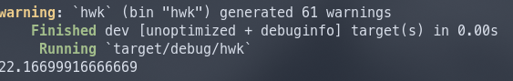

### 第三章作业

<center>201917090008 邹金廷</center>

OS: 						Arch Linux x86_64 
Kernel: 				 5.17.1-arch1-1
rustc version:     1.59.0 

代码运行：使用本地[Rust](https://www.rust-lang.org/)或在线运行：https://play.rust-lang.org/

#### 三点求导法

```rust
pub enum Formulas{
    First,
    Middle,
    End,
}

pub fn three_point_dec(x:Vec<f64>,fx:Vec<f64>,z:Formulas)->f64
{
    let h=x[1]-x[0];
    match z {
        Formulas::First=>{
            let fdx=((-3.0)*fx[0]+4.0*fx[1]-fx[2])/(2.0*h);fdx
        }
        Formulas::Middle=>{
            let fdx=(-1.0*fx[0]+fx[2])/(2.0*h);fdx
        }
        Formulas::End=>{
            let fdx=(fx[0]-4.0*fx[1]+3.0*fx[2])/(2.0*h);fdx
        }
    }
}
```

对于书中例2进行验证

```rust
    let xx:[f64;5]= [1.8,1.9,2.0,2.1,2.2];
    let x1:[f64;5]=[10.889365,12.703199,14.778112,17.148957,19.855030];
    let z1=three_point_dec(xx[2..5].to_vec(),x1[2..5].to_vec(),Formulas::First);
    let z2=three_point_dec(xx[1..4].to_vec(),x1[1..4].to_vec(), Formulas::Middle);
    println!("{}",z1);
    println!("{}",z2);
```


基本与书中一致

#### 五点法

```rust
pub fn five_point_dec(x:Vec<f64>,fx:Vec<f64>,z:Formulas)->f64{
    let h=x[1]-x[0];
    match z {
        Formulas::First=>{
            let fdx=(-25.0*fx[0]+48.0*fx[1]-36.0*fx[2]+16.0*fx[3]-3.0*fx[4])/(12.0*h);
            fdx
        }
        Formulas::Middle=>{
            let fdx=(fx[0]-8.0*fx[1]+8.0*fx[3]-fx[4])/(12.0*h);
            fdx
        }
        Formulas::End=>{
            let fdx=(3.0*fx[0]-16.0*fx[1]+36.0*fx[2]-48.0*fx[3]+25.0*fx[4])/(12.0*h);
            fdx
        }
    }
}
```

代码验证（书中例2）

```rust
    println!("{}",five_point_dec(xx.to_vec(), x1.to_vec(), Formulas::Middle));
```



与书中一致

#### Simpson，Trapezoidal复合求积分

```rust
pub fn comp_simpson_rule(n:u16,a:f64,b:f64,f:&dyn Fn(f64)->f64)->f64{
    let XI0=f(a)+f(b);
    let h=(b-a)/(n as f64);
    let mut XI1=0.0;
    let mut XI2=0.0;
    
    for i in 1..n{
        let X=&a+(i as f64)*&h;
        if (i%2)==0{XI2=XI2+f(X);}
        else{XI1=XI1+f(X);}
    }
    let res=(XI0+2.0*XI2+4.0*XI1)*h/3.0;
    res
}

pub fn com_trap_rule(n:u16,a:f64,b:f64,f:&dyn Fn(f64)->f64)->f64{
    let h=(b-a)/(n as f64);
    let mut X=0.0;
    for i in 1..n{
        let x=&a+(i as f64)*h;
        X=X+f(x);
    }
    let res =(f(a)+2.0*X+f(b))*h/2.0;
    res
}
```

对于书中例2进行验证

```rust
    println!("{}",comp_simpson_rule(18, 0.0, PI, &fun2));
    println!("{}",com_trap_rule(18, 0.0, PI, &fun2));
fn fun1(x:f64)->f64{
    x.exp()
}
```


与书中结果基本一致

对于middlepoint：

```rust
pub fn com_midp_rul(n:u16,a:f64,b:f64,f:&dyn Fn(f64)->f64)->f64{
    let mut X=0.0;
    let h=(b-a)/((n+2) as f64);
    for i in 0..n/2+1{
        X=X+f(a+h*(2.0*(i as f64)+1.0));
    }
    X*h*2.0
}
```

上面例子取$n=100$

```rust
    println!("{}",com_midp_rul(100, 0.0, PI, &fun2));
```


与前面结果基本一致

#### 龙贝格方法

```rust
pub fn romberg(n:u8,a:f64,b:f64,f: &dyn Fn(f64)->f64)->f64{
    let mut h=(b-a);
    let mut R=Vec::new();
    R.push(Vec::new());R.push(Vec::new());R.push(Vec::new());
    for i in 0..n+2{R[1].push(a);R[2].push(a);}

    R[1][1]=(f(a)+f(b)) *h/2.0;
    println!("R1_1: {}",R[1][1]);

    for i in 2..n+1{

        let mut tmpr21=0.0;
        for k in 1.. (2 as i32).pow((i-2)as u32)+1{
            tmpr21=tmpr21+f(a+(k as f64-0.5)*h);
        }        
        let R21=(R[1][1]+tmpr21*h)/2.0;
        R[2][1]=R21;


        for j in 2..i+1{
            let R2j=R[2][(j-1)as usize]+(R[2][(j-1)as usize]-
                R[1][(j-1)as usize])/((4 as i32).pow(j as u32-1)-1)as f64;
            R[2][j as usize]=R2j;
        }
        for j in 1..i+1{
            println!("R2_{}: {}",j,R[2][j as usize]);
        }

        h=h/2.0;
        for j in 1..i+1{
            R[1][j as usize]=R[2][j as usize];
        }
    }
    R[2][n as usize]
}
```

对于积分
$$
\int_0^4 e^x dx
$$
进行验证，取$n=4$

```rust
    println!("{}",romberg(4, 0.0, 4.0, &fun1));
```


与实际结果一致。

#### 高斯方法

```rust
pub enum gaussiancof{
    two,
    three,
    four,
    five,
}

pub fn Gaussian(a:f64,b:f64,f:&dyn Fn(f64)->f64,z:gaussiancof)->f64{
    let mut root=Vec::new();
    let mut coff=Vec::new();
    let mut res=0.0;
    match  z{
        gaussiancof::two=>{
            root=Vec::from([0.5773502692,-0.5773502692]);
            coff=Vec::from([1.0000000000,1.0000000000]);
        }
        gaussiancof::three=>{
            root=Vec::from([0.7745966692,0.0000000000,-0.7745966692]);
            coff=Vec::from([0.5555555556,0.8888888889,0.5555555556]);
        }
        gaussiancof::four=>{
            root=Vec::from([0.8611363116,0.6521451549,-0.3399810436,-0.8611363116]);
            coff=Vec::from([0.3478548451,0.6521451549,0.6521451549,0.3478548451]);
        }
        gaussiancof::five=>{
            root=Vec::from([0.9061798459,0.5384693101,0.0000000000,-0.5384693101,-0.9061798459]);
            coff=Vec::from([0.2369268850,0.4786286705,0.5688888889,0.4786286705,0.2369268850]);
        }
    }
    for i in 0..root.len(){
        res=res+coff[i]*f(((b-a)*root[i]+b+a)/2.0)*(b-a)/2.0;
    }
    res
}
```

对于书中例2进行验证

```rust
    println!("{}",Gaussian(1.0, 3.0, &guass_fun1, gaussiancof::two));
    println!("{}",Gaussian(1.0, 3.0, &guass_fun1, gaussiancof::three));
    
fn guass_fun1(x:f64)->f64{
    let mut z=1.0;
    for i in 0..6{
        z=z*x
    }
    z=z-x*x*((2.0*x).sin());
    z
}
```


与书中结果一致。

#### 高斯重积分

```rust
pub fn Gaussian_Double(m:gaussiancof,n:gaussiancof,
    d:&dyn Fn(f64)->f64,c:&dyn Fn(f64)->f64,
    b:f64,a:f64,f:&dyn Fn(f64,f64)->f64)->f64
{
    let mut rootM=Vec::new();
    let mut coffM=Vec::new();
    let mut m1=0;
    let mut n1=0;
    match m{
        gaussiancof::two=>{
            rootM=Vec::from([0.5773502692,-0.5773502692]);
            coffM=Vec::from([1.0000000000,1.0000000000]);
            m1=2;
        }
        gaussiancof::three=>{
            rootM=Vec::from([0.7745966692,0.0000000000,-0.7745966692]);
            coffM=Vec::from([0.5555555556,0.8888888889,0.5555555556]);
            m1=3;
        }
        gaussiancof::four=>{
            rootM=Vec::from([0.8611363116,0.6521451549,-0.3399810436,-0.8611363116]);
            coffM=Vec::from([0.3478548451,0.6521451549,0.6521451549,0.3478548451]);
            m1=4;
        }
        gaussiancof::five=>{
            rootM=Vec::from([0.9061798459,0.5384693101,0.0000000000,-0.5384693101,-0.9061798459]);
            coffM=Vec::from([0.2369268850,0.4786286705,0.5688888889,0.4786286705,0.2369268850]);
            m1=5;
        }
    }

    let mut rootN=Vec::new();
    let mut coffN=Vec::new();
    match n{
        gaussiancof::two=>{
            rootN=Vec::from([0.5773502692,-0.5773502692]);
            coffN=Vec::from([1.0000000000,1.0000000000]);
            n1=2;
        }
        gaussiancof::three=>{
            rootN=Vec::from([0.7745966692,0.0000000000,-0.7745966692]);
            coffN=Vec::from([0.5555555556,0.8888888889,0.5555555556]);
            n1=3;
        }
        gaussiancof::four=>{
            rootN=Vec::from([0.8611363116,0.6521451549,-0.3399810436,-0.8611363116]);
            coffN=Vec::from([0.3478548451,0.6521451549,0.6521451549,0.3478548451]);
            n1=4;
        }
        gaussiancof::five=>{
            rootN=Vec::from([0.9061798459,0.5384693101,0.0000000000,-0.5384693101,-0.9061798459]);
            coffN=Vec::from([0.2369268850,0.4786286705,0.5688888889,0.4786286705,0.2369268850]);
            n1=5;
        }
    }

    let h1=(b-a)/2.0;
    let h2=(b+a)/2.0;
    let mut J=0.0;

    for i in 0..m1 as usize{
        let mut JX=0.0;
        let x=h1*rootM[i]+h2;
        let d1=d(x);
        let c1=c(x);
        let k1=(d1-c1)/2.0;
        let k2=(d1+c1)/2.0;

        for j in 0..n1 as usize{
            let y=k1*rootN[j]+k2;
            let Q=f(x,y);
            JX=JX+coffN[j]*Q;
        }
        J=J+coffM[i]*k1*JX;
    }


    h1*J
}

```

对于书中例2进行计算

```rust
    let asd=Gaussian_Double(gaussiancof::three,gaussiancof::three,
        &testd,&testc, 2.0,1.4, &fun4);
    println!("{}",asd);
    
fn fun4(x:f64,y:f64)->f64{
    (x+2.0*y).ln()
}
```


与书中结果一致。


## 书中题目解答

#### 176第五题a

```rust
    let x_0=[2.1,2.2,2.3,2.4,2.5,2.6];
    let fx0=[-1.709847,-1.373823,-1.119214,-0.9160143,-0.7470223,-0.6015966];
    let fd0=five_point_dec(x_0[0..5].to_vec(),fx0[0..5].to_vec(), Formulas::First);
    let fd1=five_point_dec(x_0[1..6].to_vec(),fx0[1..6].to_vec(), Formulas::First);
    let fd2=five_point_dec(x_0[0..5].to_vec(),fx0[0..5].to_vec(), Formulas::Middle);
    let fd3=five_point_dec(x_0[1..6].to_vec(),fx0[1..6].to_vec(), Formulas::Middle);
    let fd4=five_point_dec(x_0[0..5].to_vec(),fx0[0..5].to_vec(), Formulas::End);
    let fd5=five_point_dec(x_0[1..6].to_vec(),fx0[1..6].to_vec(), Formulas::End);

    println!("f'({}):{}",x_0[0],fd0);
    println!("f'({}),{}",x_0[1],fd1);
    println!("f'({}):{}",x_0[2],fd2);
    println!("f'({}):{}",x_0[3],fd3);
    println!("f'({}):{}",x_0[4],fd4);
    println!("f'({}):{}",x_0[5],fd5);
```


#### 185页8:

$$
f'(x_0)=N_0(h)+K_1h+K_2h^2+K_3h^3....\\
f'(x_0)=[2N_0(\frac{h}{2})-N_0(h)]+K_1(h-h)+K_2'h^2+K_3'h^3+....
$$
取
$$
N_1(h)=2N_0(\frac{h}{2}-N_0(h))
$$
于是
$$
f'(x_0)=N_1(h)+K_2'h^2+K_3'h^3+....\\
3f'(x_0)=[4N_1(\frac{h}{2})-N_1(h)]+K_2'(h-h)+K_3''h^3+....
$$
于是取
$$
N_2(h)=[4N_1(\frac{h}{2})-N_1(h)]/3
$$
即可

#### 185页9:

$$
M=N(h)+K_1h+K_2h^2+K_3h^3+...\\
2M=[3N(\frac{h}{3})-N(h)]+K_1(h-h)+K_2'h^2+K_3'h^3+...
$$

取

$$
N_1(h)=[3N(\frac{h}{3})-N(h)]/2
$$

于是
$$
M=N_1(h)+K_2'h^2+K_3'h^3+...
8M=[9N_1(\frac{h}{9})-N_1(h)]+K_2'(h-h)+K_3''h^3+...
$$
取
$$
N_2(h)=[9N_1(\frac{h}{9})-N_1(h)]/2
$$
即可。

#### 204页7

$$
|f''''(x)|=|-e^{2x}(119sin(3x)+120cos(3x))|<120\sqrt{2}e^4<9270，x\in[0,2]\\
|f''(x)|=|e^{2x}(12\cos(3x)-5\sin(3x))|<13e^4<710，x\in[0,2]
$$


对于复合辛普森方法：
$$
error=\frac{b-a}{180}h^4f^{(4)}(\mu)
$$

$$
h=\frac{b-a}{n}
$$

取$n=40$即可

对于三点法
$$
error=\frac{b-a}{12}h^2f''(\mu)
$$
取$n=500$即可

对于中点法
$$
error=\frac{b-a}{6}h^2f''(\mu)
$$
同样取1000即可

```rust
    println!("{}",comp_simpson_rule(40, 0.0, 2.0, &integ_fun1));
    println!("{}",com_trap_rule(500,0.0,2.0,&integ_fun1));
    println!("{}",com_midp_rul(600,0.0,2.0,&integ_fun1));
    
fn integ_fun1(x:f64)->f64{
    let z=(2.0*x).exp();
    z*((3.0*x).sin())
}
```


#### 211页4b

$R_{k,j}$误差为$O(h_k^{2j})$，于是取$n=6$即可

```rust
   println!("{}",romberg(6, 0.0, 0.3, &integ_fun3));
fn integ_fun3(x:f64)->f64{
    if (0.0<=x)&&(x<=0.1){x*x*x+1.0}
    else if (0.1<x)&&(x<=0.2) { 1.001+0.03*(x-0.1)+0.3*(x-0.1)*(x-0.1)+2.0*(x-0.1)*(x-0.1)*(x-0.1)}
    else {
        1.009+0.15*(x-0.2)+0.9*(x-0.2)*(x-0.2)+2.0*(x-0.2)*(x-0.2)*(x-0.2)
    }
}
```


#### 226页1b

```rust
    println!("{}",Gaussian(0.0, 1.0, &integ_fun2, gaussiancof::two));
    println!("{}",Gaussian(0.0, 1.0, &integ_fun2, gaussiancof::three));
    println!("{}",Gaussian(0.0, 1.0, &integ_fun2, gaussiancof::four));
    println!("{}",Gaussian(0.0, 1.0, &integ_fun2, gaussiancof::five));
    
fn integ_fun2(x:f64)->f64{
    let z=(-1.0*x).exp();
    z*x*x
}
```


#### 239页1b

```rust
   let gdi=Gaussian_Double(gaussiancof::four, gaussiancof::four, 
        &integ_fn_ld, &integ_fn_lc, 0.5, 0.0, &integ_fun_l);
        println!("{}",gdi);
fn integ_fun_l(x:f64,y:f64)->f64{
    (y-x).exp()
}
fn integ_fn_ld(x:f64)->f64{
    0.5
}
fn integ_fn_lc(x:f64)->f64{
    0.0
}
```


代码：

main.rs

```rust
mod Derivative;
mod integ;

use std::{vec, f64::consts::PI};
use Derivative::{three_point_dec, Formulas};
use crate::Derivative::five_point_dec;
use crate::integ::Gaussian;
use crate::integ::Gaussian_Double;
use crate::integ::com_midp_rul;
use crate::integ::com_trap_rule;
use crate::integ::comp_simpson_rule;
use crate::integ::gaussiancof;
use crate::integ::romberg;


fn main() {
    // let x_0=[2.1,2.2,2.3,2.4,2.5,2.6];
    // let fx0=[-1.709847,-1.373823,-1.119214,-0.9160143,-0.7470223,-0.6015966];
    // let fd0=five_point_dec(x_0[0..5].to_vec(),fx0[0..5].to_vec(), Formulas::First);
    // let fd1=five_point_dec(x_0[1..6].to_vec(),fx0[1..6].to_vec(), Formulas::First);
    // let fd2=five_point_dec(x_0[0..5].to_vec(),fx0[0..5].to_vec(), Formulas::Middle);
    // let fd3=five_point_dec(x_0[1..6].to_vec(),fx0[1..6].to_vec(), Formulas::Middle);
    // let fd4=five_point_dec(x_0[0..5].to_vec(),fx0[0..5].to_vec(), Formulas::End);
    // let fd5=five_point_dec(x_0[1..6].to_vec(),fx0[1..6].to_vec(), Formulas::End);

    // println!("f'({}):{}",x_0[0],fd0);
    // println!("f'({}),{}",x_0[1],fd1);
    // println!("f'({}):{}",x_0[2],fd2);
    // println!("f'({}):{}",x_0[3],fd3);
    // println!("f'({}):{}",x_0[4],fd4);
    // println!("f'({}):{}",x_0[5],fd5);


    // println!("{}",comp_simpson_rule(400, 0.0, 2.0, &integ_fun1));
    // println!("{}",com_trap_rule(5000,0.0,2.0,&integ_fun1));
    // println!("{}",com_midp_rul(10000,0.0,2.0,&integ_fun1));

    // println!("{}",romberg(6, 0.0, 0.3, &integ_fun3));

    // println!("{}",Gaussian(0.0, 1.0, &integ_fun2, gaussiancof::two));
    // println!("{}",Gaussian(0.0, 1.0, &integ_fun2, gaussiancof::three));
    // println!("{}",Gaussian(0.0, 1.0, &integ_fun2, gaussiancof::four));
    // println!("{}",Gaussian(0.0, 1.0, &integ_fun2, gaussiancof::five));

    let gdi=Gaussian_Double(gaussiancof::five, gaussiancof::five, 
        &integ_fn_ld, &integ_fn_lc, 0.5, 0.0, &integ_fun_l);
        println!("{}",gdi);
    // let xx:[f64;5]= [1.8,1.9,2.0,2.1,2.2];
    // let x1:[f64;5]=[10.889365,12.703199,14.778112,17.148957,19.855030];
    // let z1=three_point_dec(xx[2..5].to_vec(),x1[2..5].to_vec(),Formulas::First);
    // let z2=three_point_dec(xx[1..4].to_vec(),x1[1..4].to_vec(), Formulas::Middle);
    // println!("{}",z1);
    // println!("{}",z2);
    // println!("{}",five_point_dec(xx.to_vec(), x1.to_vec(), Formulas::Middle));
    // println!("{}",comp_simpson_rule(4, 0.0, 4.0, &fun1));
    // println!("{}",comp_simpson_rule(18, 0.0, PI, &fun2));
    // println!("{}",com_trap_rule(18, 0.0, PI, &fun2));
    // println!("{}",com_midp_rul(100, 0.0, PI, &fun2));
    // println!("{}",romberg(4, 0.0, 4.0, &fun1));
    // println!("{}",Gaussian(1.0, 3.0, &guass_fun1, gaussiancof::two));
    // println!("{}",Gaussian(1.0, 3.0, &guass_fun1, gaussiancof::three));

    // let asd=Gaussian_Double(gaussiancof::three,gaussiancof::three,
    //     &testd,&testc, 2.0,1.4, &fun4);
    // println!("{}",asd);
}

fn integ_fun_l(x:f64,y:f64)->f64{
    (y-x).exp()
}
fn integ_fn_ld(x:f64)->f64{
    0.5
}
fn integ_fn_lc(x:f64)->f64{
    0.0
}

fn integ_fun1(x:f64)->f64{
    let z=(2.0*x).exp();
    z*((3.0*x).sin())
}

fn integ_fun2(x:f64)->f64{
    let z=(-1.0*x).exp();
    z*x*x
}

fn integ_fun3(x:f64)->f64{
    if (0.0<=x)&&(x<=0.1){x*x*x+1.0}
    else if (0.1<x)&&(x<=0.2) { 1.001+0.03*(x-0.1)+0.3*(x-0.1)*(x-0.1)+2.0*(x-0.1)*(x-0.1)*(x-0.1)}
    else {
        1.009+0.15*(x-0.2)+0.9*(x-0.2)*(x-0.2)+2.0*(x-0.2)*(x-0.2)*(x-0.2)
    }
}

fn testd(x:f64)->f64{
    1.5
}

fn testc(x:f64)->f64{
    1.0
}

fn fun1(x:f64)->f64{
    x.exp()
}

fn fun2(x:f64)->f64{
    x.sin()
}

fn fun3(x:f64)->f64{
    x.exp()*x.cos()
}

fn guass_fun1(x:f64)->f64{
    let mut z=1.0;
    for i in 0..6{
        z=z*x
    }
    z=z-x*x*((2.0*x).sin());
    z
}

fn fun4(x:f64,y:f64)->f64{
    (x+2.0*y).ln()
}
```

Derivative.rs

```rust
pub enum Formulas{
    First,
    Middle,
    End,
}

pub fn three_point_dec(x:Vec<f64>,fx:Vec<f64>,z:Formulas)->f64
{
    let h=x[1]-x[0];
    match z {
        Formulas::First=>{
            let fdx=((-3.0)*fx[0]+4.0*fx[1]-fx[2])/(2.0*h);fdx
        }
        Formulas::Middle=>{
            let fdx=(-1.0*fx[0]+fx[2])/(2.0*h);fdx
        }
        Formulas::End=>{
            let fdx=(fx[0]-4.0*fx[1]+3.0*fx[2])/(2.0*h);fdx
        }
    }
}

pub fn five_point_dec(x:Vec<f64>,fx:Vec<f64>,z:Formulas)->f64{
    let h=x[1]-x[0];
    match z {
        Formulas::First=>{
            let fdx=(-25.0*fx[0]+48.0*fx[1]-36.0*fx[2]+16.0*fx[3]-3.0*fx[4])/(12.0*h);
            fdx
        }
        Formulas::Middle=>{
            let fdx=(fx[0]-8.0*fx[1]+8.0*fx[3]-fx[4])/(12.0*h);
            fdx
        }
        Formulas::End=>{
            let fdx=(3.0*fx[0]-16.0*fx[1]+36.0*fx[2]-48.0*fx[3]+25.0*fx[4])/(12.0*h);
            fdx
        }
    }
}
```

integ.rs

```rust
fn trapezoidal(a:f64,b:f64,f:&dyn Fn(f64) -> f64)->f64{
    let h=b-a;
    let tr=(f(a)+f(b))*h/2.0;
    tr
}

fn simpson(a:f64,b:f64,f:&dyn Fn(f64)->f64)->f64{
    let h=(b-a)/2.0;
    let si=(f(a)+4.0*f(a+h)+f(b))*h/3.0;
    si
}

pub fn comp_simpson_rule(n:u16,a:f64,b:f64,f:&dyn Fn(f64)->f64)->f64{
    let XI0=f(a)+f(b);
    let h=(b-a)/(n as f64);
    let mut XI1=0.0;
    let mut XI2=0.0;
    
    for i in 1..n{
        let X=&a+(i as f64)*&h;
        if (i%2)==0{XI2=XI2+f(X);}
        else{XI1=XI1+f(X);}
    }
    let res=(XI0+2.0*XI2+4.0*XI1)*h/3.0;
    res
}

pub fn com_trap_rule(n:u16,a:f64,b:f64,f:&dyn Fn(f64)->f64)->f64{
    let h=(b-a)/(n as f64);
    let mut X=0.0;
    for i in 1..n{
        let x=&a+(i as f64)*h;
        X=X+f(x);
    }
    let res =(f(a)+2.0*X+f(b))*h/2.0;
    res
}

pub fn com_midp_rul(n:u16,a:f64,b:f64,f:&dyn Fn(f64)->f64)->f64{
    let mut X=0.0;
    let h=(b-a)/((n+2) as f64);
    for i in 0..n/2+1{
        X=X+f(a+h*(2.0*(i as f64)+1.0));
        // println!("{},{},{}",i,(2.0*(i as f64)+1.0),a+h*(2.0*(i as f64)+1.0));
    }
    X*h*2.0
}


pub fn romberg(n:u16,a:f64,b:f64,f: &dyn Fn(f64)->f64)->f64{
    let mut h=(b-a);
    let mut R=Vec::new();
    R.push(Vec::new());R.push(Vec::new());R.push(Vec::new());
    for i in 0..n+2{R[1].push(a);R[2].push(a);}

    R[1][1]=(f(a)+f(b)) *h/2.0;
    println!("R1_1: {}",R[1][1]);

    for i in 2..n+1{

        let mut tmpr21=0.0;
        for k in 1.. (2 as i32).pow((i-2)as u32)+1{
            tmpr21=tmpr21+f(a+(k as f64-0.5)*h);
        }        
        let R21=(R[1][1]+tmpr21*h)/2.0;
        R[2][1]=R21;


        for j in 2..i+1{
            let R2j=R[2][(j-1)as usize]+(R[2][(j-1)as usize]-
                R[1][(j-1)as usize])/((4 as i32).pow(j as u32-1)-1)as f64;
            R[2][j as usize]=R2j;
        }
        for j in 1..i+1{
            println!("R2_{}: {}",j,R[2][j as usize]);
        }

        h=h/2.0;
        for j in 1..i+1{
            R[1][j as usize]=R[2][j as usize];
        }
    }
    R[2][n as usize]
}

pub enum gaussiancof{
    two,
    three,
    four,
    five,
}

pub fn Gaussian(a:f64,b:f64,f:&dyn Fn(f64)->f64,z:gaussiancof)->f64{
    let mut root=Vec::new();
    let mut coff=Vec::new();
    let mut res=0.0;
    match  z{
        gaussiancof::two=>{
            root=Vec::from([0.5773502692,-0.5773502692]);
            coff=Vec::from([1.0000000000,1.0000000000]);
        }
        gaussiancof::three=>{
            root=Vec::from([0.7745966692,0.0000000000,-0.7745966692]);
            coff=Vec::from([0.5555555556,0.8888888889,0.5555555556]);
        }
        gaussiancof::four=>{
            root=Vec::from([0.8611363116,0.6521451549,-0.3399810436,-0.8611363116]);
            coff=Vec::from([0.3478548451,0.6521451549,0.6521451549,0.3478548451]);
        }
        gaussiancof::five=>{
            root=Vec::from([0.9061798459,0.5384693101,0.0000000000,-0.5384693101,-0.9061798459]);
            coff=Vec::from([0.2369268850,0.4786286705,0.5688888889,0.4786286705,0.2369268850]);
        }
    }
    for i in 0..root.len(){
        res=res+coff[i]*(f(((b-a)*root[i]+b+a)/2.0)*(b-a)/2.0);

    }
    res
}

pub fn Gaussian_Double(m:gaussiancof,n:gaussiancof,
    d:&dyn Fn(f64)->f64,c:&dyn Fn(f64)->f64,
    b:f64,a:f64,f:&dyn Fn(f64,f64)->f64)->f64
{
    let mut rootM=Vec::new();
    let mut coffM=Vec::new();
    let mut m1=0;
    let mut n1=0;
    match m{
        gaussiancof::two=>{
            rootM=Vec::from([0.5773502692,-0.5773502692]);
            coffM=Vec::from([1.0000000000,1.0000000000]);
            m1=2;
        }
        gaussiancof::three=>{
            rootM=Vec::from([0.7745966692,0.0000000000,-0.7745966692]);
            coffM=Vec::from([0.5555555556,0.8888888889,0.5555555556]);
            m1=3;
        }
        gaussiancof::four=>{
            rootM=Vec::from([0.8611363116,0.6521451549,-0.3399810436,-0.8611363116]);
            coffM=Vec::from([0.3478548451,0.6521451549,0.6521451549,0.3478548451]);
            m1=4;
        }
        gaussiancof::five=>{
            rootM=Vec::from([0.9061798459,0.5384693101,0.0000000000,-0.5384693101,-0.9061798459]);
            coffM=Vec::from([0.2369268850,0.4786286705,0.5688888889,0.4786286705,0.2369268850]);
            m1=5;
        }
    }

    let mut rootN=Vec::new();
    let mut coffN=Vec::new();
    match n{
        gaussiancof::two=>{
            rootN=Vec::from([0.5773502692,-0.5773502692]);
            coffN=Vec::from([1.0000000000,1.0000000000]);
            n1=2;
        }
        gaussiancof::three=>{
            rootN=Vec::from([0.7745966692,0.0000000000,-0.7745966692]);
            coffN=Vec::from([0.5555555556,0.8888888889,0.5555555556]);
            n1=3;
        }
        gaussiancof::four=>{
            rootN=Vec::from([0.8611363116,0.6521451549,-0.3399810436,-0.8611363116]);
            coffN=Vec::from([0.3478548451,0.6521451549,0.6521451549,0.3478548451]);
            n1=4;
        }
        gaussiancof::five=>{
            rootN=Vec::from([0.9061798459,0.5384693101,0.0000000000,-0.5384693101,-0.9061798459]);
            coffN=Vec::from([0.2369268850,0.4786286705,0.5688888889,0.4786286705,0.2369268850]);
            n1=5;
        }
    }

    let h1=(b-a)/2.0;
    let h2=(b+a)/2.0;
    let mut J=0.0;

    for i in 0..m1 as usize{
        let mut JX=0.0;
        let x=h1*rootM[i]+h2;
        let d1=d(x);
        let c1=c(x);
        let k1=(d1-c1)/2.0;
        let k2=(d1+c1)/2.0;

        for j in 0..n1 as usize{
            let y=k1*rootN[j]+k2;
            let Q=f(x,y);
            JX=JX+coffN[j]*Q;
        }
        J=J+coffM[i]*k1*JX;
    }


    h1*J
}

```

