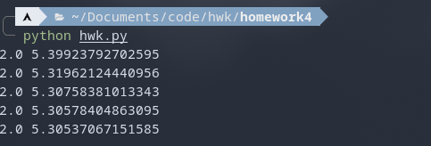

### 第三章作业


OS: 						Arch Linux x86_64 
Kernel: 				 5.17.5-arch1-1
Python version:   3.10.4

全局引用：

```python
from sympy import symbols
import copy as cp
t, y = symbols('t y')
expr = y-t*t+1
```

#### 欧拉方法

```python
def euler_method(fun, a, b, alpha, N):
    h = (b-a)/N
    t_temp = a
    w_temp = alpha
    # print("{},{}".format(t_temp, w_temp))
    for i in range(1, N+1):
        w_temp = w_temp+h*fun.subs(t, t_temp).subs(y, w_temp)
        t_temp = a+i*h

    print(t_temp, w_temp)

```

对于例1进行验证

```python
hwk1.euler_method(expr, 0, 2, 0.5, 10)
```


与书中结果一致

#### 泰勒方法

```python
def comput_diff_par(fun, fun_par):
    res = fun.diff(t)+fun.diff(y)*fun_par
    return res
def taylor_method(fun, a, b, alpha, N, degree):
    h = (b-a)/N
    t_temp = a
    w_temp = alpha
    fun_pal_n = [fun]
    for i in range(1, degree):
        fun_pal_temp = comput_diff_par(fun_pal_n[i-1], fun_pal_n[0])
        fun_pal_n.append(fun_pal_temp)

    T_N = fun
    par_temp = 1
    for i in range(1, degree):
        par_temp = h*par_temp/(i+1)
        T_N = T_N + par_temp*fun_pal_n[i]

    for i in range(1, N+1):
        w_temp = w_temp + h*T_N.subs(t, t_temp).subs(y, w_temp)
        t_temp = a+i*h

    print(t_temp, w_temp)
```

对于书中使用4阶方法进行验证

```python
hwk1.taylor_method(expr, 0, 2, 0.5, 10, 4)
```


与书中结果一致

#### 中点法，修正欧拉方法，heun方法，龙格库塔方法

```python
def mid_point_method(fun, a, b, alpha, N):
    h = (b-a)/N
    t_temp = a
    w_temp = alpha

    for i in range(1, N+1):
        temp = h*fun.subs(t, t_temp).subs(y, w_temp)/2
        w_temp = w_temp+h*fun.subs(t, t_temp+h/2).subs(y, w_temp+temp)
        t_temp = a+i*h

    print(t_temp, w_temp)

def modi_euler_method(fun, a, b, alpha, N):
    h = (b-a)/N
    t_temp = a
    w_temp = alpha

    for i in range(1, N+1):
        temp = fun.subs(t, t_temp).subs(y, w_temp)
        t_temp_p1 = a+i*h
        w_temp = w_temp+h*(temp+fun.subs(t, t_temp_p1).subs(y, w_temp+h*temp))/2
        t_temp = t_temp_p1

    print(t_temp, w_temp)

def heun_method(fun, a, b, alpha, N):
    h = (b-a)/N
    t_temp = a
    w_temp = alpha

    for i in range(1, N+1):
        temp = fun.subs(t, t_temp).subs(y, w_temp)
        w_temp = w_temp+(temp+3*fun.subs(t,t_temp+h*2/3).subs(y,w_temp+2*h*temp/3))*h/4 
        t_temp = a+i*h

    print(t_temp, w_temp)

def runge_kutta_method_four(fun, a, b, alpha, N):
    h = (b-a)/N
    t_temp = a
    w_temp = alpha 

    for i in range(1, N+1):
        K1 = h*fun.subs(t, t_temp).subs(y, w_temp)
        K2 = h*fun.subs(t, t_temp+h/2).subs(y, w_temp+K1/2)
        K3 = h*fun.subs(t, t_temp+h/2).subs(y, w_temp+K2/2)
        K4 = h*fun.subs(t, t_temp+h).subs(y, w_temp+K3)

        w_temp = w_temp+(K1+2*K2+2*K3+K4)/6
        t_temp = a+i*h

    print(t_temp, w_temp)
```

对于书中例子进行验证

```python
hwk1.mid_point_method(expr, 0, 2, 0.5, 10)
hwk1.modi_euler_method(expr, 0, 2, 0.5, 10)
hwk1.heun_method(expr, 0, 2, 0.5, 10)
hwk1.runge_kutta_method_four(expr, 0, 2, 0.5, 10)
```


与书中结果一致

#### 多步法

```python
def adams_bash_two(fun, a, b, w0, w1, N):
    h = (b-a)/N
    w = [w0, w1]
    t_temp = [a, a+h]

    for i in range(1, N):
        w_ip1 = w[i]+h*(3*fun.subs(t, t_temp[i]).subs(y, w[i])-
            fun.subs(t, t_temp[i-1]).subs(y, w[i-1]))/2
        w.append(w_ip1)
        t_temp.append(a+(i+1)*h)
    print(t_temp[N], w[N])
    

def adams_bash_three(fun, a, b, w0, w1, w2, N):
    h = (b-a)/N
    w = [w0, w1, w2]
    t_temp = [a, a+h, a+2*h]
    for i in range(2, N):
        w_ip1 = w[i]+h*(23*fun.subs(t, t_temp[i]).subs(y, w[i])
            -16*fun.subs(t, t_temp[i-1]).subs(y, w[i-1])+
            5*fun.subs(t, t_temp[i-2]).subs(y, w[i-2]))/12
        w.append(w_ip1)
        t_temp.append(a+(i+1)*h)

    print(t_temp[N], w[N])
    
def adams_bash_four(fun, a, b, w0, w1, w2, w3, N):
    h = (b-a)/N
    w = [w0, w1, w2, w3]
    t_temp = [a, a+h, a+2*h, a+3*h]

    for i in range(3, N):
        w_ip1 = w[i]+h*(55*fun.subs(t, t_temp[i]).subs(y, w[i])
            -59*fun.subs(t, t_temp[i-1]).subs(y, w[i-1])
            +37*fun.subs(t, t_temp[i-2]).subs(y, w[i-2])
            -9*fun.subs(t, t_temp[i-3]).subs(y, w[i-3]))/24
        w.append(w_ip1)
        t_temp.append(a+(i+1)*h)
    # print(w)
    print(t_temp[N], w[N])

def adams_bash_five(fun, a, b, w0, w1, w2, w3, w4, N):
    h = (b-a)/N
    w = [w0, w1, w2, w3, w4]
    t_temp = [a, a+h, a+2*h, a+3*h, a+4*h]

    for i in range(4, N):
        w_ip1 = w[i]+h*(1901*fun.subs(t, t_temp[i]).subs(y, w[i])
            -2774*fun.subs(t, t_temp[i-1]).subs(y, w[i-1])
            +2616*fun.subs(t, t_temp[i-2]).subs(y, w[i-2])
            -1274*fun.subs(t, t_temp[i-3]).subs(y, w[i-3])
            +251*fun.subs(t, t_temp[i-4]).subs(y, w[i-4]))/720
        w.append(w_ip1)
        t_temp.append(a+(i+1)*h)

    print(t_temp[N], w[N])


def adams_four_oder_pc(fun, a, b, alpha, N):
    h = (b-a)/N
    t_temp = [a]
    w_temp = [alpha]

    for i in range(1, 4):
        K1 = h*fun.subs(t, t_temp[i-1]).subs(y, w_temp[i-1])
        K2 = h*fun.subs(t, t_temp[i-1]+(h/2)).subs(y, w_temp[i-1]+(K1/2))
        K3 = h*fun.subs(t, t_temp[i-1]+(h/2)).subs(y, w_temp[i-1]+(K2/2))
        K4 = h*fun.subs(t, t_temp[i-1]+h).subs(y, w_temp[i-1]+K3)

        wi = w_temp[i-1]+(K1+2*K2+2*K3+K4)/6
        w_temp.append(wi)
        t_temp.append(a+i*h)

    for i in range(4, N+1):
        t_this = a+i*h
        w_this = w_temp[3]+h*(55*fun.subs(t, t_temp[3]).subs(y, w_temp[3])
            -59*fun.subs(t, t_temp[2]).subs(y, w_temp[2])
            +37*fun.subs(t, t_temp[1]).subs(y, w_temp[1])
            -9*fun.subs(t, t_temp[0]).subs(y, w_temp[0]))/24
        w = w_temp[3]+h*(9*fun.subs(t, t_this).subs(y, w_this)
            +19*fun.subs(t, t_temp[3]).subs(y, w_temp[3])
            -5*fun.subs(t, t_temp[2]).subs(y, w_temp[2])
            +fun.subs(t, t_temp[1]).subs(y, w_temp[1]))/24

        for j in range(0, 3):
            t_temp[j] = t_temp[j+1]
            w_temp[j] = w_temp[j+1]
        w_temp[3] = w
        t_temp[3] = t_this

    print(t_temp[3], w_temp[3])
```

 对于书中例子进行验证

```python
hwk1.adams_bash_two(expr, 0, 2, fun_val[0], fun_val[1], 10)
hwk1.adams_bash_three(expr, 0, 2, fun_val[0], fun_val[1], fun_val[2], 10)
hwk1.adams_bash_four(expr, 0, 2, fun_val[0], fun_val[1], fun_val[2], fun_val[3], 10)
hwk1.adams_bash_five(expr, 0, 2, fun_val[0], fun_val[1], fun_val[2], fun_val[3], fun_val[4], 10)
hwk1.adams_four_oder_pc(expr, 0, 2, 0.5, 10)
```



4阶与4阶修正与书中结果一致，其他由于书中没有结果，但总体差不多

#### 高阶方程

```python
def runge_kutta_sys_diff_equ(a, b, fun: list, alpha: list, N):
    m = len(fun)
    h = (b-a)/N
    t_temp = a
    w_temp = []
    K1 = []
    K2 = []
    K3 = []
    K4 = []
    for i in range(0, m):
        w_temp.append(alpha[i])
        K1.append(0.0)
        K2.append(0.0)
        K3.append(0.0)
        K4.append(0.0)

    for i in range(0, N):
        
        for j in range(0, m):
            K1j = h*fun[j](t_temp, w_temp)
            K1[j] = K1j

        for j in range(0, m):
            k1temp = cp.deepcopy(K1)
            wtempthis = cp.deepcopy(w_temp)
            for k in range(0, m):
                wtempthis[k] = wtempthis[k]+k1temp[k]/2
            
            K2j = h*fun[j](t_temp+h/2, wtempthis)
            K2[j] = K2j
            # print("k2:", K2)
            # print(t_temp+h/2, wtempthis)

        for j in range(0, m):
            k2temp = cp.deepcopy(K2)
            wtempthis = cp.deepcopy(w_temp)
            for k in range(0, m):
                wtempthis[k] = wtempthis[k]+k2temp[k]/2
            
            k3j = h*fun[j](t_temp+h/2, wtempthis)
            K3[j] = k3j
            # print("k3:", K3)

        for j in range(0, m):
            k3temp = cp.deepcopy(K3)
            wtempthis = cp.deepcopy(w_temp)
            for k in range(0, m):
                wtempthis[k] = wtempthis[k]+k3temp[k]

            k4j = h*fun[j](t_temp+h, wtempthis)
            K4[j] = k4j
            # print("k4:", K4)
        
        for j in range(0, m):
            w_temp[j] = w_temp[j]+(K1[j]+2*K2[j]+2*K3[j]+K4[j])/6

        t_temp = t_temp+h
        # print(t_temp, w_temp)

    print(t_temp, w_temp)

```

对于书中例子进行验证

```python
alpha_of_fun=[0,0]
def fun1(t1, vec):
    return -4*vec[0]+3*vec[1]+6

def fun2(t1, vec):
    return -2.4*vec[0]+1.6*vec[1]+3.6

fun_12=[fun1, fun2]

hwk1.runge_kutta_sys_diff_equ(0, 0.5, fun_12, alpha_of_fun, 5)
```


与书中结果一致


### 题目解答

##### 264.7

```python
fun7 = -y+t+1

hwk1.euler_method(fun7, 0, 5, 1, 25)
hwk1.euler_method(fun7, 0, 5, 1, 50)
hwk1.euler_method(fun7, 0, 5, 1, 100)
```


$$
h=\sqrt{2\frac{10^{-6}}{M}}\\
y''=-y'+1=y-t-1+1=e^{-t}\\
|y''|\leq1\\
h=1.41\times10^{-3}
$$

#### 280.4

```python
fun4c = -(y+1)*(y+3)
def real_fun4c(x):
    return -3+2/(1+math.exp(-2*x))
hwk1.modi_euler_method(fun4c, 0, 2, -2, 10)
print(real_fun4c(2))

```


#### 280.5

```python
def liner(x1,y1,x2,y2):
    k = (y2-y1)/(x2-x1)
    b = y1-k*x1
    def fun1(x):
        return k*x+b
    return fun1

print(liner(1.2, -1.1722, 1.4, -1.12008)(1.3), real_fun4c(1.3))
print(liner(1.8, -1.05717, 2.0, -1.03919)(1.93), real_fun4c(1.93))
```


#### 280.6

```python
hwk1.heun_method(fun4c, 0 ,2, -2, 10)
print(real_fun4c(2))
```


#### 280.7

```python
print(liner(1.2, -1.16999323088721, 1.4, -1.11836177932903)(1.3), real_fun4c(1.3))
print(liner(1.8, -1.05625058113905, 2.0, -1.03854252366502)(1.93), real_fun4c(1.93))
```


#### 280.8

```python
hwk1.mid_point_method(fun4c, 0, 2, -2, 10)
print(real_fun4c(2))
```


#### 280.9

```python
print(liner(1.2, -1.16889758797353, 1.4, -1.11751648737120)(1.3), real_fun4c(1.3))
print(liner(1.8, -1.05579872156681, 2.0, -1.03822269715153)(1.93), real_fun4c(1.93))
```


#### 280.11

```python
hwk1.runge_kutta_method_four(fun4c, 0, 2, -2, 10)
print(real_fun4c(2))
```


#### 280.12

```python
fun4creal = -3+2/(1+sympy.exp(-2*t))
print(fun4creal.diff().subs(t,1.0))
print(fun4creal.diff().subs(t,1.2))
print(fun4creal.diff().subs(t,1.4))


print(fun4creal.diff().subs(t,1.6))
print(fun4creal.diff().subs(t,1.8))
print(fun4creal.diff().subs(t,2.0))
```

```c++
double real_fun_test(double x){
    return -3+2/(1+std::exp(-2*x));
}
    std::vector<double> vec31={1.0,1.2,1.4};
    std::vector<double> vec32={-1.23843073814929,-1.16637354288998,-1.11467693804580};
    std::vector<double> vec33={0.419974341614026,0.305019996207409,0.216152459025537};
    polynomial<double> pol3=hermite_inter(std::move(vec31),std::move(vec32),std::move(vec33));
    cout<<eva_poly(std::move(pol3.data()),1.3)<<" "<<real_fun_test(1.3)<<endl;

    std::vector<double> vec31_test={1.6,1.8,2.0};
    std::vector<double> vec32_test={-1.07835820540806,-1.05321754719743,-1.03599222316296};
    std::vector<double> vec33_test={0.150527075818285,0.103558374038152,0.0706508248531645};
    polynomial<double> pol3_test=hermite_inter(std::move(vec31_test),std::move(vec32_test),std::move(vec33_test));
    cout<<eva_poly(std::move(pol3_test.data()),1.93)<<" "<<real_fun_test(1.93)<<endl;
```


#### 300.3

```python
fun_val_of_rk=[-2,-1.80262739207947,-1.62005763880431,-1.46296283879001,-1.33598238271148]

hwk1.adams_bash_two(fun4c, 0, 2, fun_val_of_rk[0], fun_val_of_rk[1], 10)
hwk1.adams_bash_three(fun4c, 0, 2, fun_val_of_rk[0], fun_val_of_rk[1], fun_val_of_rk[2], 10)
hwk1.adams_bash_four(fun4c, 0, 2, fun_val_of_rk[0], fun_val_of_rk[1], fun_val_of_rk[2], fun_val_of_rk[3], 10)
hwk1.adams_bash_five(fun4c, 0, 2, fun_val_of_rk[0], fun_val_of_rk[1], fun_val_of_rk[2], fun_val_of_rk[3], fun_val_of_rk[4], 10)
print("real val:",real_fun4c(2))
```


#### 300.5

```python
hwk1.adams_four_oder_pc(fun4c, 0, 2, -2, 10)
```


#### 300.6

```python
def adams_four_oder_pc_p(fun, a, b, alpha, N, p):
    h = (b-a)/N
    t_temp = [a]
    w_temp = [alpha]

    for i in range(1, 4):
        K1 = h*fun.subs(t, t_temp[i-1]).subs(y, w_temp[i-1])
        K2 = h*fun.subs(t, t_temp[i-1]+(h/2)).subs(y, w_temp[i-1]+(K1/2))
        K3 = h*fun.subs(t, t_temp[i-1]+(h/2)).subs(y, w_temp[i-1]+(K2/2))
        K4 = h*fun.subs(t, t_temp[i-1]+h).subs(y, w_temp[i-1]+K3)

        wi = w_temp[i-1]+(K1+2*K2+2*K3+K4)/6
        w_temp.append(wi)
        t_temp.append(a+i*h)

    for i in range(4, N+1):
        t_this = a+i*h
        w_this = w_temp[3]+h*(55*fun.subs(t, t_temp[3]).subs(y, w_temp[3])
            -59*fun.subs(t, t_temp[2]).subs(y, w_temp[2])
            +37*fun.subs(t, t_temp[1]).subs(y, w_temp[1])
            -9*fun.subs(t, t_temp[0]).subs(y, w_temp[0]))/24

       
        w = w_temp[3]+h*(9*fun.subs(t, t_this).subs(y, w_this)
            +19*fun.subs(t, t_temp[3]).subs(y, w_temp[3])
            -5*fun.subs(t, t_temp[2]).subs(y, w_temp[2])
            +fun.subs(t, t_temp[1]).subs(y, w_temp[1]))/24

        for j in range(0,p-1):
            w = w_temp[3]+h*(9*fun.subs(t, t_this).subs(y, w)
                +19*fun.subs(t, t_temp[3]).subs(y, w_temp[3])
                -5*fun.subs(t, t_temp[2]).subs(y, w_temp[2])
                +fun.subs(t, t_temp[1]).subs(y, w_temp[1]))/24

        for j in range(0, 3):
            t_temp[j] = t_temp[j+1]
            w_temp[j] = w_temp[j+1]
        w_temp[3] = w
        t_temp[3] = t_this

    print(w_temp[3], p)

for i in range(2,5):

    adams_four_oder_pc_p(fun4c, 0, 2, -2, 10, i)
```


可以看出修正两次结果最好

#### 323.2

$$
y'''+2y''-y'-2y=e^t
\\u_1=y,u_2=y',u_3=y'',u_4=y'''\\

\left\{
	\begin{array}{**lr}	
		\dfrac{du_1}{dt}=u_2\\
		\dfrac{du_2}{dt}=u_3\\
		\dfrac{du_3}{dt}=e^t+2u_1+u_2-2u_3
	\end{array}
\right.
$$

```python
alpha_of_fun_sys=[1, 2, 0]
def fun1_sys(t1, vec):
    return vec[1]

def fun2_sys(t1, vec):
    return vec[2]

def fun3_sys(t1, vec):
    return math.exp(t1)+2*vec[0]+vec[1]-2*vec[2]
fun_12=[fun1_sys, fun2_sys, fun3_sys]

hwk1.runge_kutta_sys_diff_equ(0, 3, fun_12, alpha_of_fun_sys, 15)

def autual_fun_sys(x):
    return 43*math.exp(x)/36+math.exp(-x)/4-4*math.exp(-2*x)/9+x*math.exp(x)/6

autual_fun_sys1=43*sympy.exp(t)/36+sympy.exp(-t)/4-4*sympy.exp(-2*t)/9+t*sympy.exp(t)/6
print("y:",autual_fun_sys1.subs(t,3).evalf(17))

print("y\':",autual_fun_sys1.diff(t).subs(t,3).evalf(17))


print("y\":",autual_fun_sys1.diff(t).diff(t).subs(t,3).evalf(17))
```


附：

hwk1.py

```python
from sympy import symbols
import copy as cp
t, y = symbols('t y')

# expr = y-t*t+1


def comput_diff_par(fun, fun_par):
    res = fun.diff(t)+fun.diff(y)*fun_par
    return res


def euler_method(fun, a, b, alpha, N):
    h = (b-a)/N
    t_temp = a
    w_temp = alpha
    # print("{},{}".format(t_temp, w_temp))
    for i in range(1, N+1):
        w_temp = w_temp+h*fun.subs(t, t_temp).subs(y, w_temp)
        t_temp = a+i*h

    print(t_temp, w_temp)


# euler_method(expr, 0, 2, 0.5, 10)


def taylor_method(fun, a, b, alpha, N, degree):
    h = (b-a)/N
    t_temp = a
    w_temp = alpha
    fun_pal_n = [fun]
    for i in range(1, degree):
        fun_pal_temp = comput_diff_par(fun_pal_n[i-1], fun_pal_n[0])
        fun_pal_n.append(fun_pal_temp)

    T_N = fun
    par_temp = 1
    for i in range(1, degree):
        par_temp = h*par_temp/(i+1)
        T_N = T_N + par_temp*fun_pal_n[i]
    # print(T_N)
    for i in range(1, N+1):
        w_temp = w_temp + h*T_N.subs(t, t_temp).subs(y, w_temp)
        t_temp = a+i*h

    print(t_temp, w_temp)

# taylor_method(expr, 0, 2, 0.5, 10, 2)

def mid_point_method(fun, a, b, alpha, N):
    h = (b-a)/N
    t_temp = a
    w_temp = alpha

    for i in range(1, N+1):
        temp = h*fun.subs(t, t_temp).subs(y, w_temp)/2
        w_temp = w_temp+h*fun.subs(t, t_temp+h/2).subs(y, w_temp+temp)
        t_temp = a+i*h
        # print(t_temp, w_temp)

    print(t_temp, w_temp)

def modi_euler_method(fun, a, b, alpha, N):
    h = (b-a)/N
    t_temp = a
    w_temp = alpha

    for i in range(1, N+1):
        temp = fun.subs(t, t_temp).subs(y, w_temp)
        t_temp_p1 = a+i*h
        w_temp = w_temp+h*(temp+fun.subs(t, t_temp_p1).subs(y, w_temp+h*temp))/2
        t_temp = t_temp_p1
        # print(t_temp, w_temp)

    print(t_temp, w_temp)

def heun_method(fun, a, b, alpha, N):
    h = (b-a)/N
    t_temp = a
    w_temp = alpha

    for i in range(1, N+1):
        temp = fun.subs(t, t_temp).subs(y, w_temp)
        w_temp = w_temp+(temp+3*fun.subs(t,t_temp+h*2/3).subs(y,w_temp+2*h*temp/3))*h/4 
        t_temp = a+i*h
        # print(t_temp, w_temp)

    print(t_temp, w_temp)

def runge_kutta_method_four(fun, a, b, alpha, N):
    h = (b-a)/N
    t_temp = a
    w_temp = alpha 

    for i in range(1, N+1):
        K1 = h*fun.subs(t, t_temp).subs(y, w_temp)
        K2 = h*fun.subs(t, t_temp+h/2).subs(y, w_temp+K1/2)
        K3 = h*fun.subs(t, t_temp+h/2).subs(y, w_temp+K2/2)
        K4 = h*fun.subs(t, t_temp+h).subs(y, w_temp+K3)

        w_temp = w_temp+(K1+2*K2+2*K3+K4)/6
        t_temp = a+i*h
        # print(t_temp, w_temp)

    print(t_temp, w_temp)


def adams_bash_two(fun, a, b, w0, w1, N):
    h = (b-a)/N
    w = [w0, w1]
    t_temp = [a, a+h]

    for i in range(1, N):
        w_ip1 = w[i]+h*(3*fun.subs(t, t_temp[i]).subs(y, w[i])-
            fun.subs(t, t_temp[i-1]).subs(y, w[i-1]))/2
        w.append(w_ip1)
        t_temp.append(a+(i+1)*h)
    print(t_temp[N], w[N])
    

def adams_bash_three(fun, a, b, w0, w1, w2, N):
    h = (b-a)/N
    w = [w0, w1, w2]
    t_temp = [a, a+h, a+2*h]
    for i in range(2, N):
        w_ip1 = w[i]+h*(23*fun.subs(t, t_temp[i]).subs(y, w[i])
            -16*fun.subs(t, t_temp[i-1]).subs(y, w[i-1])+
            5*fun.subs(t, t_temp[i-2]).subs(y, w[i-2]))/12
        w.append(w_ip1)
        t_temp.append(a+(i+1)*h)

    print(t_temp[N], w[N])
    
def adams_bash_four(fun, a, b, w0, w1, w2, w3, N):
    h = (b-a)/N
    w = [w0, w1, w2, w3]
    t_temp = [a, a+h, a+2*h, a+3*h]

    for i in range(3, N):
        w_ip1 = w[i]+h*(55*fun.subs(t, t_temp[i]).subs(y, w[i])
            -59*fun.subs(t, t_temp[i-1]).subs(y, w[i-1])
            +37*fun.subs(t, t_temp[i-2]).subs(y, w[i-2])
            -9*fun.subs(t, t_temp[i-3]).subs(y, w[i-3]))/24
        w.append(w_ip1)
        t_temp.append(a+(i+1)*h)
    # print(w)
    print(t_temp[N], w[N])

def adams_bash_five(fun, a, b, w0, w1, w2, w3, w4, N):
    h = (b-a)/N
    w = [w0, w1, w2, w3, w4]
    t_temp = [a, a+h, a+2*h, a+3*h, a+4*h]

    for i in range(4, N):
        w_ip1 = w[i]+h*(1901*fun.subs(t, t_temp[i]).subs(y, w[i])
            -2774*fun.subs(t, t_temp[i-1]).subs(y, w[i-1])
            +2616*fun.subs(t, t_temp[i-2]).subs(y, w[i-2])
            -1274*fun.subs(t, t_temp[i-3]).subs(y, w[i-3])
            +251*fun.subs(t, t_temp[i-4]).subs(y, w[i-4]))/720
        w.append(w_ip1)
        t_temp.append(a+(i+1)*h)

    print(t_temp[N], w[N])


def adams_four_oder_pc(fun, a, b, alpha, N):
    h = (b-a)/N
    t_temp = [a]
    w_temp = [alpha]

    for i in range(1, 4):
        K1 = h*fun.subs(t, t_temp[i-1]).subs(y, w_temp[i-1])
        K2 = h*fun.subs(t, t_temp[i-1]+(h/2)).subs(y, w_temp[i-1]+(K1/2))
        K3 = h*fun.subs(t, t_temp[i-1]+(h/2)).subs(y, w_temp[i-1]+(K2/2))
        K4 = h*fun.subs(t, t_temp[i-1]+h).subs(y, w_temp[i-1]+K3)

        wi = w_temp[i-1]+(K1+2*K2+2*K3+K4)/6
        w_temp.append(wi)
        t_temp.append(a+i*h)

    for i in range(4, N+1):
        t_this = a+i*h
        w_this = w_temp[3]+h*(55*fun.subs(t, t_temp[3]).subs(y, w_temp[3])
            -59*fun.subs(t, t_temp[2]).subs(y, w_temp[2])
            +37*fun.subs(t, t_temp[1]).subs(y, w_temp[1])
            -9*fun.subs(t, t_temp[0]).subs(y, w_temp[0]))/24
        w = w_temp[3]+h*(9*fun.subs(t, t_this).subs(y, w_this)
            +19*fun.subs(t, t_temp[3]).subs(y, w_temp[3])
            -5*fun.subs(t, t_temp[2]).subs(y, w_temp[2])
            +fun.subs(t, t_temp[1]).subs(y, w_temp[1]))/24

        for j in range(0, 3):
            t_temp[j] = t_temp[j+1]
            w_temp[j] = w_temp[j+1]
        w_temp[3] = w
        t_temp[3] = t_this

    print(t_temp[3], w_temp[3])

def runge_kutta_sys_diff_equ(a, b, fun: list, alpha: list, N):
    m = len(fun)
    h = (b-a)/N
    t_temp = a
    w_temp = []
    K1 = []
    K2 = []
    K3 = []
    K4 = []
    for i in range(0, m):
        w_temp.append(alpha[i])
        K1.append(0.0)
        K2.append(0.0)
        K3.append(0.0)
        K4.append(0.0)

    for i in range(0, N):
        
        for j in range(0, m):
            K1j = h*fun[j](t_temp, w_temp)
            K1[j] = K1j

        for j in range(0, m):
            k1temp = cp.deepcopy(K1)
            wtempthis = cp.deepcopy(w_temp)
            for k in range(0, m):
                wtempthis[k] = wtempthis[k]+k1temp[k]/2
            
            K2j = h*fun[j](t_temp+h/2, wtempthis)
            K2[j] = K2j
            # print("k2:", K2)
            # print(t_temp+h/2, wtempthis)

        for j in range(0, m):
            k2temp = cp.deepcopy(K2)
            wtempthis = cp.deepcopy(w_temp)
            for k in range(0, m):
                wtempthis[k] = wtempthis[k]+k2temp[k]/2
            
            k3j = h*fun[j](t_temp+h/2, wtempthis)
            K3[j] = k3j
            # print("k3:", K3)

        for j in range(0, m):
            k3temp = cp.deepcopy(K3)
            wtempthis = cp.deepcopy(w_temp)
            for k in range(0, m):
                wtempthis[k] = wtempthis[k]+k3temp[k]

            k4j = h*fun[j](t_temp+h, wtempthis)
            K4[j] = k4j
            # print("k4:", K4)
        
        for j in range(0, m):
            w_temp[j] = w_temp[j]+(K1[j]+2*K2[j]+2*K3[j]+K4[j])/6

        t_temp = t_temp+h
        # print(t_temp, w_temp)

    print(t_temp, w_temp)

```

hwk.py

```python
import sys
sys.path.append('/home/charles/Documents/code/hwk/homework4/1.py')
import hwk1
from sympy import symbols
import sympy
import math


t, y = symbols('t y')

expr = y-t*t+1

# hwk1.euler_method(expr, 0, 2, 0.5, 10)
# hwk1.taylor_method(expr, 0, 2, 0.5, 10, 4)

# hwk1.mid_point_method(expr, 0, 2, 0.5, 10)
# hwk1.modi_euler_method(expr, 0, 2, 0.5, 10)
# hwk1.heun_method(expr, 0, 2, 0.5, 10)
# hwk1.runge_kutta_method_four(expr, 0, 2, 0.5, 10)


def fun_test(x):
    return (x+1)**2-0.5*math.exp(x)

fun_val = []
for i in range(0, 6):
    fun_val.append(fun_test(0.2*i))

# # print(fun_val)
# hwk1.adams_bash_two(expr, 0, 2, fun_val[0], fun_val[1], 10)
# hwk1.adams_bash_three(expr, 0, 2, fun_val[0], fun_val[1], fun_val[2], 10)
# hwk1.adams_bash_four(expr, 0, 2, fun_val[0], fun_val[1], fun_val[2], fun_val[3], 10)
# hwk1.adams_bash_five(expr, 0, 2, fun_val[0], fun_val[1], fun_val[2], fun_val[3], fun_val[4], 10)
# hwk1.adams_four_oder_pc(expr, 0, 2, 0.5, 10)


# alpha_of_fun=[0,0]
# def fun1(t1, vec):
#     return -4*vec[0]+3*vec[1]+6

# def fun2(t1, vec):
#     return -2.4*vec[0]+1.6*vec[1]+3.6

# fun_12=[fun1, fun2]

# hwk1.runge_kutta_sys_diff_equ(0, 0.5, fun_12, alpha_of_fun, 5)

# def fun_k1(t1, vec):
#     return vec[1]

# def fun_k2(t1, vec):
#     return math.exp(2*t1)*math.sin(t1)-2*vec[0]+2*vec[1]

# fun_k12=[fun_k1,fun_k2]
# alpk=[-0.4,-0.6]
# hwk1.runge_kutta_sys_diff_equ(0, 1, fun_k12, alpk, 10)

# fun7 = -y+t+1

# # print(fun7.subs(t,0).subs(y,0))
# hwk1.euler_method(fun7, 0, 5, 1, 25)
# hwk1.euler_method(fun7, 0, 5, 1, 50)
# hwk1.euler_method(fun7, 0, 5, 1, 100)

fun4c = -(y+1)*(y+3)
def real_fun4c(x):
    return -3+2/(1+math.exp(-2*x))
# hwk1.modi_euler_method(fun4c, 0, 2, -2, 10)
# print(real_fun4c(2))

# def liner(x1,y1,x2,y2):
#     k = (y2-y1)/(x2-x1)
#     b = y1-k*x1
#     def fun1(x):
#         return k*x+b
#     return fun1


# print(liner(1.2, -1.1722, 1.4, -1.12008)(1.3), real_fun4c(1.3))
# print(liner(1.8, -1.05717, 2.0, -1.03919)(1.93), real_fun4c(1.93))

# hwk1.heun_method(fun4c, 0 , 2, -2, 10)
# print(real_fun4c(2))

# print(liner(1.2, -1.16999323088721, 1.4, -1.11836177932903)(1.3), real_fun4c(1.3))
# print(liner(1.8, -1.05625058113905, 2.0, -1.03854252366502)(1.93), real_fun4c(1.93))

# hwk1.mid_point_method(fun4c, 0, 2, -2, 10)
# print(real_fun4c(2))

# print(liner(1.2, -1.16889758797353, 1.4, -1.11751648737120)(1.3), real_fun4c(1.3))
# print(liner(1.8, -1.05579872156681, 2.0, -1.03822269715153)(1.93), real_fun4c(1.93))

# hwk1.runge_kutta_method_four(fun4c, 0, 2, -2, 10)
# print(real_fun4c(2))

# fun4creal = -3+2/(1+sympy.exp(-2*t))
# print(fun4creal.diff().subs(t,1.0))
# print(fun4creal.diff().subs(t,1.2))
# print(fun4creal.diff().subs(t,1.4))


# print(fun4creal.diff().subs(t,1.6))
# print(fun4creal.diff().subs(t,1.8))
# print(fun4creal.diff().subs(t,2.0))

# hwk1.runge_kutta_method_four(fun4c, 0, 2, -2, 10)

fun_val_of_rk=[-2,-1.80262739207947,-1.62005763880431,-1.46296283879001,-1.33598238271148]

# hwk1.adams_bash_two(fun4c, 0, 2, fun_val_of_rk[0], fun_val_of_rk[1], 10)
# hwk1.adams_bash_three(fun4c, 0, 2, fun_val_of_rk[0], fun_val_of_rk[1], fun_val_of_rk[2], 10)
# hwk1.adams_bash_four(fun4c, 0, 2, fun_val_of_rk[0], fun_val_of_rk[1], fun_val_of_rk[2], fun_val_of_rk[3], 10)
# hwk1.adams_bash_five(fun4c, 0, 2, fun_val_of_rk[0], fun_val_of_rk[1], fun_val_of_rk[2], fun_val_of_rk[3], fun_val_of_rk[4], 10)
# print("real val:",real_fun4c(2))
# hwk1.adams_four_oder_pc(fun4c, 0, 2, -2, 10)

# def adams_four_oder_pc_p(fun, a, b, alpha, N, p):
#     h = (b-a)/N
#     t_temp = [a]
#     w_temp = [alpha]

#     for i in range(1, 4):
#         K1 = h*fun.subs(t, t_temp[i-1]).subs(y, w_temp[i-1])
#         K2 = h*fun.subs(t, t_temp[i-1]+(h/2)).subs(y, w_temp[i-1]+(K1/2))
#         K3 = h*fun.subs(t, t_temp[i-1]+(h/2)).subs(y, w_temp[i-1]+(K2/2))
#         K4 = h*fun.subs(t, t_temp[i-1]+h).subs(y, w_temp[i-1]+K3)

#         wi = w_temp[i-1]+(K1+2*K2+2*K3+K4)/6
#         w_temp.append(wi)
#         t_temp.append(a+i*h)

#     for i in range(4, N+1):
#         t_this = a+i*h
#         w_this = w_temp[3]+h*(55*fun.subs(t, t_temp[3]).subs(y, w_temp[3])
#             -59*fun.subs(t, t_temp[2]).subs(y, w_temp[2])
#             +37*fun.subs(t, t_temp[1]).subs(y, w_temp[1])
#             -9*fun.subs(t, t_temp[0]).subs(y, w_temp[0]))/24

       
#         w = w_temp[3]+h*(9*fun.subs(t, t_this).subs(y, w_this)
#             +19*fun.subs(t, t_temp[3]).subs(y, w_temp[3])
#             -5*fun.subs(t, t_temp[2]).subs(y, w_temp[2])
#             +fun.subs(t, t_temp[1]).subs(y, w_temp[1]))/24

#         for j in range(0,p-1):
#             w = w_temp[3]+h*(9*fun.subs(t, t_this).subs(y, w)
#                 +19*fun.subs(t, t_temp[3]).subs(y, w_temp[3])
#                 -5*fun.subs(t, t_temp[2]).subs(y, w_temp[2])
#                 +fun.subs(t, t_temp[1]).subs(y, w_temp[1]))/24

#         for j in range(0, 3):
#             t_temp[j] = t_temp[j+1]
#             w_temp[j] = w_temp[j+1]
#         w_temp[3] = w
#         t_temp[3] = t_this

#     print(w_temp[3], p)

# for i in range(2,5):

#     adams_four_oder_pc_p(fun4c, 0, 2, -2, 10, i)

alpha_of_fun_sys=[1, 2, 0]
def fun1_sys(t1, vec):
    return vec[1]

def fun2_sys(t1, vec):
    return vec[2]

def fun3_sys(t1, vec):
    return math.exp(t1)+2*vec[0]+vec[1]-2*vec[2]
fun_12=[fun1_sys, fun2_sys, fun3_sys]

hwk1.runge_kutta_sys_diff_equ(0, 3, fun_12, alpha_of_fun_sys, 15)

def autual_fun_sys(x):
    return 43*math.exp(x)/36+math.exp(-x)/4-4*math.exp(-2*x)/9+x*math.exp(x)/6

autual_fun_sys1=43*sympy.exp(t)/36+sympy.exp(-t)/4-4*sympy.exp(-2*t)/9+t*sympy.exp(t)/6
print("y:",autual_fun_sys1.subs(t,3).evalf(17))

print("y\':",autual_fun_sys1.diff(t).subs(t,3).evalf(17))


print("y\":",autual_fun_sys1.diff(t).diff(t).subs(t,3).evalf(17))
```
