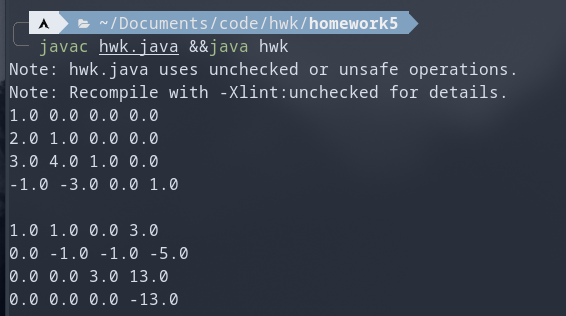
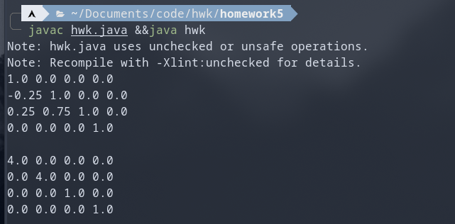
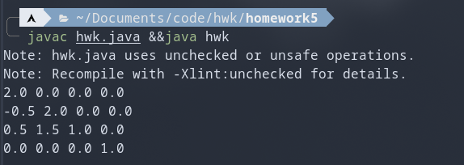
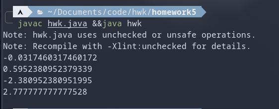
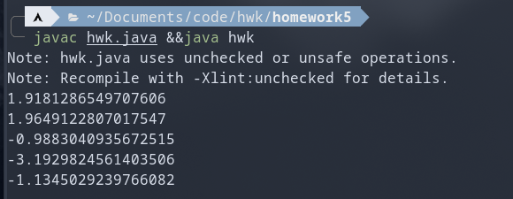
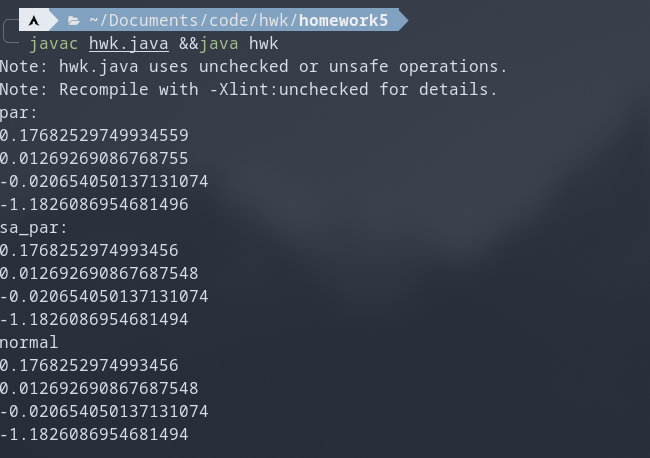
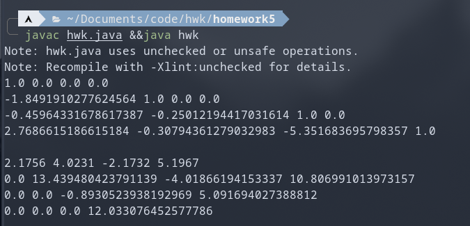
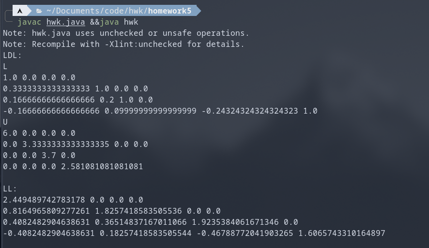

### 第六章作业


OS: 						Arch Linux x86_64 
Kernel: 				 5.17.9-arch1-1
openjdk version:18.0.1.1 2022-04-22

使用的类和方法：

basic_op class

```java
class basic_op {
  public static <T> void exch(T[][] array, int i, int j) {
    T[] temp = array[i];
    array[i] = array[j];
    array[j] = temp;
  }

  public static <T extends Comparable> void sort_row(T[][] array, int rows) {
    Arrays.sort(array, new Comparator<T[]>() {
      @Override
      public int compare(T[] arg0, T[] arg1) {
        return arg0[rows].compareTo(arg1[rows]);
      }
    });
  }

  static class inner<T extends Number & Comparable> implements Comparable<inner> {
    public T num;
    public Integer cols;

    public inner(T num, Integer cols) {
      this.num = num;
      this.cols = cols;
    }

    public int compareTo(inner other) {
      return this.num.compareTo(other.num);
    }
  }

  public static <T extends Number & Comparable> int min_row_num(T[][] array, int row, int beg, int end, int num) {
    Vector<inner> a = new Vector<>();
    for (int i = beg; i < end + 1; i++) {
      a.add(new inner(array[i][row], i));
    }
    Collections.sort(a);
    // System.out.println(a.get(num).num);
    return a.get(num).cols;
  }

  public static <T> void show(T[][] array) {
    for (int i = 0; i < array.length; i++) {
      String str = "";
      for (int j = 0; j < array[i].length; j++) {
        str += array[i][j];
        str += " ";
      }
      System.out.println(str);
    }
  }

  public static int max_vec(Double[] array, int beg, int end) {
    Vector<inner> temp = new Vector<>();
    for (int i = beg; i < end + 1; i++) {
      temp.add(new inner(array[i], i));
    }
    Collections.sort(temp);
    return temp.get(temp.size() - 1).cols;
  }

  public static int max_row_abs(Double[][] array, int row, int beg, int end) {

    Vector<inner> temp = new Vector<>();
    for (int i = beg; i < end + 1; i++) {
      temp.add(new inner(Math.abs(array[i][row]), i));
    }
    Collections.sort(temp);
    // System.out.println(temp.get(0).cols);
    return temp.get(temp.size() - 1).cols;
  }

  public static int max_col_abs(Double[][] array, int col, int beg, int end) {

    Vector<inner> temp = new Vector<>();
    for (int i = beg; i < end + 1; i++) {
      temp.add(new inner(Math.abs(array[col][i]), i));
    }
    Collections.sort(temp);
    // System.out.println(temp.get(0).cols);
    return temp.get(temp.size() - 1).cols;
  }

  public static <T extends Number & Comparable> int min_row_nozero(T[][] array, int row, int beg, int end) {
    int res;
    int temp_col = 0;
    while (true) {

      int p_col = min_row_num(array, row, beg, end, temp_col);
      // System.out.println(str);
      if (array[p_col][row].equals(0.0)) {
        temp_col++;
      } else {
        res = p_col;
        break;
      }
    }
    return res;
  }

}
```

### Gaussian Elimination

```java
public static void backward(Double[][] array1) {
    Double[][] array = array1.clone();
    for (int i = 0; i < array.length - 1; i++) {
      int p_col = basic_op.min_row_nozero(array, i, i, array.length - 1);
      if (p_col != i) {
        basic_op.exch(array, p_col, i);
      }
      for (int j = i + 1; j < array.length; j++) {
        Double mij = array[j][i] / array[i][i];
        // System.out.println(mij);
        for (int k = 0; k < array.length + 1; k++) {
          array[j][k] = array[j][k] - (mij * array[i][k]);
        }
      }
      // basic_op.show(array);
      // System.out.println("");
    }
    if (array[array.length - 1][array.length - 1].equals(0.0)) {
      System.out.println("error");
      return;
    }
    Vector<Double> res = new Vector<>();
    res.add(array[array.length - 1][array.length] / array[array.length - 1][array.length - 1]);

    for (int i = array.length - 2; i >= 0; i--) {
      Double temp = 0.0;
      for (int j = i + 1; j < array.length; j++) {
        temp += array[i][j] * res.get(array.length - j - 1);
      }
      Double xi = (array[i][array.length] - temp) / array[i][i];
      res.add(xi);
    }
    for (int i = 0; i < res.size(); i++) {
      System.out.println(res.get(array1.length - i - 1));
    }
  }
```

对于书中例3进行测试

```java
    Double[][] testa = {
        { 1.0, -1.0, 2.0, -1.0, -8.0 },
        { 2.0, -2.0, 3.0, -3.0, -20.0 },
        { 1.0, 1.0, 1.0, 0.0, -2.0 },
        { 1.0, -1.0, 4.0, 3.0, 4.0 }
    };
    guassian_elim.backward(testa);
```


与书中结果一致

### Gaussian Elimination with Partial Pivoting 
```java
  public static void paritial_piv(Double[][] array1) {
    Double[][] array = array1.clone();
    // Vector<Integer> NROW = new Vector<>();
    Integer[] NROW = new Integer[array.length];
    for (int i = 0; i < array.length; i++) {
      NROW[i] = i;
    }
    for (int i = 0; i < array.length - 1; i++) {
      int p_col = basic_op.max_row_abs(array, i, i, array.length - 1);
      if (array[p_col][i].equals(0.0)) {
        System.out.println("error");
        return;
      }
      if (p_col != i) {
        // basic_op.exch(array, p_col, i);
        Integer NCOPY = NROW[i];
        NROW[i] = NROW[p_col];
        NROW[p_col] = NCOPY;
      }
      for (int j = i + 1; j < array.length; j++) {
        Double mij = array[NROW[j]][i] / array[NROW[i]][i];

        for (int k = 0; k < array.length + 1; k++) {
          array[NROW[j]][k] = array[NROW[j]][k] - (mij * array[NROW[i]][k]);
        }
      }
    }
    if (array[NROW[array.length - 1]][array.length - 1].equals(0.0)) {
      System.out.println("error");
      return;
    }
    Vector<Double> res = new Vector<>();
    res.add(array[NROW[array.length - 1]][array.length] / array[NROW[array.length - 1]][array.length - 1]);

    for (int i = array.length - 2; i >= 0; i--) {
      Double temp = 0.0;
      for (int j = i + 1; j < array.length; j++) {
        temp += array[NROW[i]][j] * res.get(array.length - j - 1);
      }
      Double xi = (array[NROW[i]][array.length] - temp) / array[NROW[i]][i];
      res.add(xi);
    }
    for (int i = 0; i < res.size(); i++) {
      System.out.println(res.get(array1.length - i - 1));
    }
  }
```

对于书中例2进行验证

```java
    Double [][]tstpr={
      {0.003,59.14,59.17},
      {5.291,-6.13,46.78}
    };
    guassian_elim.paritial_piv(tstpr);
```


与书中结果一致

### Gaussian Elimination with Scaled Partial Pivoting 

```java
 public static void sacled_paritial_piv(Double[][] array1) {
    Double[][] array = array1.clone();
    Double[] s = new Double[array.length];
    Integer[] NROW = new Integer[array.length];

    for (int i = 0; i < array.length; i++) {

      int si_col = basic_op.max_col_abs(array, i, 0, array.length - 1);
      // System.out.println(si_col);
      s[i] = Math.abs(array[i][si_col]);
      if (s[i].equals(0.0)) {
        System.out.println("error");
        break;
      }
      NROW[i] = i;
    }

    for (int i = 0; i < array.length - 1; i++) {
      Double[] temp_p = new Double[array.length];
      for (int j = 0; j < array.length; j++) {
        temp_p[j] = Math.abs(array[NROW[j]][i]) / s[NROW[j]];
      }

      int p_col = basic_op.max_vec(temp_p, i, array.length - 1);

      if (array[p_col][i].equals(0.0)) {
        System.out.println("error1");
        return;
      }

      if (p_col != i) {
        // basic_op.exch(array, p_col, i);
        Integer NCOPY = NROW[i];
        NROW[i] = NROW[p_col];
        NROW[p_col] = NCOPY;
      }
      for (int j = i + 1; j < array.length; j++) {
        Double mij = array[NROW[j]][i] / array[NROW[i]][i];
        for (int k = 0; k < array.length + 1; k++) {
          array[NROW[j]][k] = array[NROW[j]][k] - (mij * array[NROW[i]][k]);
        }
      }
      // basic_op.show(array);
    }
    if (array[NROW[array.length - 1]][array.length - 1].equals(0.0)) {
      System.out.println("error");
      return;
    }
    Vector<Double> res = new Vector<>();

    res.add(array[NROW[array.length - 1]][array.length] / array[NROW[array.length - 1]][array.length - 1]);
    for (int i = array.length - 2; i >= 0; i--) {
      Double temp = 0.0;
      for (int j = i + 1; j < array.length; j++) {
        temp += array[NROW[i]][j] * res.get(array.length - j - 1);
      }
      Double xi = (array[NROW[i]][array.length] - temp) / array[NROW[i]][i];
      res.add(xi);
    }
    for (int i = 0; i < res.size(); i++) {
      System.out.println(res.get(array1.length - i - 1));
    }
  }
```

对书中例3进行验证

```java
    Double[][] tstssp = {
        { 30.00, 591400.0, 591700.0 },
        { 5.291, -6.13, 46.78 }
    };
    guassian_elim.sacled_paritial_piv(tstssp);
```


与书中结果一致

### LU分解

```java
 public static void LU(Double[][] array1, Double[][] L, Double[][] U) {
    Double[][] array = array1.clone();
    L[0][0] = 1.0;
    U[0][0] = array[0][0] / L[0][0];

    for (int i = 1; i < array.length; i++) {
      U[0][i] = array[0][i] / L[0][0];
      L[i][0] = array[i][0] / U[0][0];
    }
    for (int i = 1; i < array.length; i++) {
      L[i][i] = 1.0;
      Double temp1 = 0.0;
      for (int k = 0; k < i; k++) {
        temp1 += L[i][k] * U[k][i];
      }
      U[i][i] = (array[i][i] - temp1) / L[i][i];

      for (int j = i + 1; j < array.length; j++) {
        Double tempuij = 0.0;
        for (int k = 0; k < i; k++) {
          tempuij += L[i][k] * U[k][j];
        }
        U[i][j] = (array[i][j] - tempuij) / L[i][i];

        Double templij = 0.0;
        for (int k = 0; k < i; k++) {
          templij += L[j][k] * U[k][i];
        }
        L[j][i] = (array[j][i] - templij) / U[i][i];
      }
    }
    L[array.length - 1][array.length - 1] = 1.0;
    Double tempunn = 0.0;
    for (int k = 0; k < array.length - 1; k++) {
      tempunn += L[array.length - 1][k] * U[k][array.length - 1];
    }
    U[array.length - 1][array.length - 1] = (array[array.length - 1][array.length - 1] - tempunn)
        / L[array.length - 1][array.length - 1];

  }
```

对于书中例1进行验证：

```java
    Double A[][] = {
        { 1.0, 1.0, 0.0, 3.0 },
        { 2.0, 1.0, -1.0, 1.0 },
        { 3.0, -1.0, -1.0, 2.0 },
        { -1.0, 2.0, 3.0, -1.0 }
    };
    Double L1[][] = {
        { 1.0, 0.0, 0.0, 0.0 },
        { 0.0, 1.0, 0.0, 0.0 },
        { 0.0, 0.0, 1.0, 0.0 },
        { 0.0, 0.0, 0.0, 1.0 }
    };
    Double U1[][] = {
        { 1.0, 0.0, 0.0, 0.0 },
        { 0.0, 1.0, 0.0, 0.0 },
        { 0.0, 0.0, 1.0, 0.0 },
        { 0.0, 0.0, 0.0, 1.0 }
    };
    guassian_elim.LU(A, L1, U1);
    basic_op.show(L1);
    System.out.println("");
    basic_op.show(U1);
```



与书中结果一致

### LDL分解

```java
  public static void LDL(Double[][] array1, Double[][] L, Double[][] D) {
    Double[][] array = array1.clone();
    for (int i = 0; i < array.length; i++) {
      Double[] v = new Double[i];
      for (int j = 0; j < i; j++) {
        v[j] = L[i][j] * D[j][j];
      }
      Double tempdi = 0.0;
      for (int j = 0; j < i; j++) {
        tempdi += L[i][j] * v[j];
      }
      D[i][i] = array[i][i] - tempdi;

      for (int j = i + 1; j < array.length; j++) {
        Double templij = 0.0;
        for (int k = 0; k < i; k++) {
          templij += L[j][k] * v[k];
        }
        L[j][i] = (array[j][i] - templij) / D[i][i];
      }
    }
  }
```

 对于书中例4进行验证

```java
    Double[][] ALDL = {
        { 4.0, -1.0, 1.0 },
        { -1.0, 4.25, 2.75 },
        { 1.0, 2.75, 3.5 }
    };
    guassian_elim.LDL(ALDL, L1, U1);
    basic_op.show(L1);
    System.out.println("");
    basic_op.show(U1);
```



与书中结果一致，（书中L，U应该为三姐矩阵，我这里图省事用的前面定义的四阶矩阵）

### LL分解

```java
  public static void LL(Double[][] array1, Double[][] L) {
    Double[][] array = array1.clone();
    L[0][0] = Math.sqrt(array[0][0]);
    for (int i = 1; i < array.length; i++) {
      L[i][0] = array[i][0] / L[0][0];
    }
    for (int i = 1; i < array.length - 1; i++) {
      Double templii = 0.0;
      for (int k = 0; k < i; k++) {
        templii += L[i][k] * L[i][k];
      }
      L[i][i] = Math.sqrt(array[i][i] - templii);

      for (int j = i + 1; j < array.length; j++) {
        Double templji = 0.0;
        for (int k = 0; k < i; k++) {
          templji += L[j][k] * L[i][k];
        }
        L[j][i] = (array[j][i] - templji) / L[i][i];
      }
    }
    Double templnn = 0.0;
    for (int k = 0; k < array.length - 1; k++) {
      templnn += L[array.length - 1][k] * L[array.length - 1][k];
    }
    L[array.length - 1][array.length - 1] = Math.sqrt(array[array.length - 1][array.length - 1] - templnn);
  }
```

对于书中例4进行验证

```java
    guassian_elim.LL(ALDL, L1);
    basic_op.show(L1);
```



与书中结果一致

### 书中题目解答

357.4c

```java
    Double[][] fourc = {
        { 1.0, 0.5, 1.0 / 3.0, 0.25, 1.0 / 6.0 },
        { 0.5, 1.0 / 3.0, 0.25, 1.0 / 5.0, 1.0 / 7.0 },
        { 1.0 / 3.0, 0.25, 1.0 / 5.0, 1.0 / 6.0, 0.125 },
        { 0.25, 1.0 / 5.0, 1.0 / 6.0, 1.0 / 7.0, 1.0 / 9.0 }
    };
    guassian_elim.backward(fourc);
```



357.4d

```java
    Double [][] fourd={
      {2.0,1.0,-1.0,1.0,-3.0,7.0},
      {1.0,0.0,2.0,-1.0,1.0,2.0},
      {0.0,-2.0,-1.0,1.0,-1.0,-5.0},
      {3.0,1.0,-4.0,0.0,5.0,6.0},
      {1.0,-1.0,-1.0,-1.0,1.0,3.0}
    };
    guassian_elim.backward(fourd);
```



369.5e

```java
    Double [][]fivec={
      {1.19,2.11,-100.0,1.0,1.12},
      {14.2,-0.122,12.2,-1.0,3.44},
      {0.0,100.0,-99.9,1.0,2.15},
      {15.3,0.11,-13.1,-1.0,4.16}
    };
    System.err.println("par:");
    guassian_elim.paritial_piv(fivec);
    System.out.println("sa_par:");
    guassian_elim.sacled_paritial_piv(fivec);
    System.out.println("normal");
    guassian_elim.backward(fivec);
```



可以看出与真实结果较为接近

396.3d

```java
    Double [][]threeed={
      {2.1756,4.0231,-2.1732,5.1967},
      {-4.0231,6.0,0.0,1.1973},
      {-1.0,-5.2107,1.111,0.0},
      {6.0235,7.0,0.0,-4.1561}
    };
    
    guassian_elim.LU(threeed, L1, U1);
    basic_op.show(L1);
    System.out.println("");
    basic_op.show(U1);
  }
```



410.2d

```java
Double [][]twod={
  {6.0,2.0,1.0,-1.0},
  {2.0,4.0,1.0,0.0},
  {1.0,1.0,4.0,-1.0},
  {-1.0,0.0,-1.0,3.0}

};
Double [][]l1clone=L1.clone();
Double [][]u1clone=U1.clone();
guassian_elim.LDL(twod, l1clone, u1clone);
System.out.println("LDL:");
System.out.println("L");
basic_op.show(l1clone);
System.out.println("U");
basic_op.show(u1clone);
System.out.println("");
System.out.println("LL:");
guassian_elim.LL(twod, L1);
basic_op.show(L1);
```



附录：

hwk.java

```java
import java.util.Arrays;
import java.util.Collections;
import java.util.Comparator;
import java.util.Vector;

public class hwk {

  public static void main(String[] args) {
    // Double a[][] = {
    // { 3.00, 0.00, 0.00, 2.00 },
    // { 1.00, 1.00, 0.00, 3.00 },
    // { 0.00, -1.00, 1.00, 4.00 }
    // };
    Double[][] testa = {
        { 1.0, -1.0, 2.0, -1.0, -8.0 },
        { 2.0, -2.0, 3.0, -3.0, -20.0 },
        { 1.0, 1.0, 1.0, 0.0, -2.0 },
        { 1.0, -1.0, 4.0, 3.0, 4.0 }
    };
    // Double[][] tstsb = {
    // { 2.11, -4.21, 0.921, 2.01 },
    // { 4.01, 10.2, -1.12, -3.09 },
    // { 1.09, 0.987, 0.832, 4.21 }
    // };
    Double[][] tstpr = {
        { 0.003, 59.14, 59.17 },
        { 5.291, -6.13, 46.78 }
    };
    Double[][] tstssp = {
        { 30.00, 591400.0, 591700.0 },
        { 5.291, -6.13, 46.78 }
    };
    // guassian_elim.sacled_paritial_piv(tstssp);
    // guassian_elim.paritial_piv(tstpr);
    // // guassian_elim.sacled_paritial_piv(tstsb);
    // guassian_elim.backward(testa);
    // guassian_elim.paritial_piv(testa);
    // guassian_elim.sacled_paritial_piv(testa);
    // guassian_elim.backward(a);
    // guassian_elim.paritial_piv(a);
    // guassian_elim.sacled_paritial_piv(a);
    // System.out.println(basic_op.max_row_abs(a, 0, 0, 2));

    // System.out.println(basic_op.max_col_abs(a, 0, 0, 3));
    Double A[][] = {
        { 1.0, 1.0, 0.0, 3.0 },
        { 2.0, 1.0, -1.0, 1.0 },
        { 3.0, -1.0, -1.0, 2.0 },
        { -1.0, 2.0, 3.0, -1.0 }
    };
    Double L1[][] = {
        { 1.0, 0.0, 0.0, 0.0 },
        { 0.0, 1.0, 0.0, 0.0 },
        { 0.0, 0.0, 1.0, 0.0 },
        { 0.0, 0.0, 0.0, 1.0 }
    };
    Double U1[][] = {
        { 1.0, 0.0, 0.0, 0.0 },
        { 0.0, 1.0, 0.0, 0.0 },
        { 0.0, 0.0, 1.0, 0.0 },
        { 0.0, 0.0, 0.0, 1.0 }
    };
    // guassian_elim.LU(A, L1, U1);
    // basic_op.show(L1);
    // System.out.println("");
    // basic_op.show(U1);
    Double[][] ALDL = {
        { 4.0, -1.0, 1.0 },
        { -1.0, 4.25, 2.75 },
        { 1.0, 2.75, 3.5 }
    };
    // guassian_elim.LDL(ALDL, L1, U1);
    // basic_op.show(L1);
    // System.out.println("");
    // basic_op.show(U1);
    // guassian_elim.LL(ALDL, L1);
    // basic_op.show(L1);
    Double[][] fourc = {
        { 1.0, 0.5, 1.0 / 3.0, 0.25, 1.0 / 6.0 },
        { 0.5, 1.0 / 3.0, 0.25, 1.0 / 5.0, 1.0 / 7.0 },
        { 1.0 / 3.0, 0.25, 1.0 / 5.0, 1.0 / 6.0, 0.125 },
        { 0.25, 1.0 / 5.0, 1.0 / 6.0, 1.0 / 7.0, 1.0 / 9.0 }
    };
    // guassian_elim.backward(fourc);
    Double[][] fourd = {
        { 2.0, 1.0, -1.0, 1.0, -3.0, 7.0 },
        { 1.0, 0.0, 2.0, -1.0, 1.0, 2.0 },
        { 0.0, -2.0, -1.0, 1.0, -1.0, -5.0 },
        { 3.0, 1.0, -4.0, 0.0, 5.0, 6.0 },
        { 1.0, -1.0, -1.0, -1.0, 1.0, 3.0 }
    };
    // guassian_elim.backward(fourd);
    Double [][]fivec={
      {1.19,2.11,-100.0,1.0,1.12},
      {14.2,-0.122,12.2,-1.0,3.44},
      {0.0,100.0,-99.9,1.0,2.15},
      {15.3,0.11,-13.1,-1.0,4.16}
    };
    // System.err.println("par:");
    // guassian_elim.paritial_piv(fivec);
    // System.out.println("sa_par:");
    // guassian_elim.sacled_paritial_piv(fivec);
    // System.out.println("normal");
    // guassian_elim.backward(fivec);
    Double [][]threeed={
      {2.1756,4.0231,-2.1732,5.1967},
      {-4.0231,6.0,0.0,1.1973},
      {-1.0,-5.2107,1.111,0.0},
      {6.0235,7.0,0.0,-4.1561}
    };
    
    // guassian_elim.LU(threeed, L1, U1);
    // basic_op.show(L1);
    // System.out.println("");
    // basic_op.show(U1);/3
    Double [][]twod={
      {6.0,2.0,1.0,-1.0},
      {2.0,4.0,1.0,0.0},
      {1.0,1.0,4.0,-1.0},
      {-1.0,0.0,-1.0,3.0}
    
    };
    Double [][]l1clone=L1.clone();
    Double [][]u1clone=U1.clone();
    guassian_elim.LDL(twod, l1clone, u1clone);
    System.out.println("LDL:");
    System.out.println("L");
    basic_op.show(l1clone);
    System.out.println("U");
    basic_op.show(u1clone);
    System.out.println("");
    System.out.println("LL:");
    guassian_elim.LL(twod, L1);
    basic_op.show(L1);
  }

}

class guassian_elim {

  public static void LL(Double[][] array1, Double[][] L) {
    Double[][] array = array1.clone();
    L[0][0] = Math.sqrt(array[0][0]);
    for (int i = 1; i < array.length; i++) {
      L[i][0] = array[i][0] / L[0][0];
    }
    for (int i = 1; i < array.length - 1; i++) {
      Double templii = 0.0;
      for (int k = 0; k < i; k++) {
        templii += L[i][k] * L[i][k];
      }
      L[i][i] = Math.sqrt(array[i][i] - templii);

      for (int j = i + 1; j < array.length; j++) {
        Double templji = 0.0;
        for (int k = 0; k < i; k++) {
          templji += L[j][k] * L[i][k];
        }
        L[j][i] = (array[j][i] - templji) / L[i][i];
      }
    }
    Double templnn = 0.0;
    for (int k = 0; k < array.length - 1; k++) {
      templnn += L[array.length - 1][k] * L[array.length - 1][k];
    }
    L[array.length - 1][array.length - 1] = Math.sqrt(array[array.length - 1][array.length - 1] - templnn);
  }

  public static void LDL(Double[][] array1, Double[][] L, Double[][] D) {
    Double[][] array = array1.clone();
    for (int i = 0; i < array.length; i++) {
      Double[] v = new Double[i];
      for (int j = 0; j < i; j++) {
        v[j] = L[i][j] * D[j][j];
      }
      Double tempdi = 0.0;
      for (int j = 0; j < i; j++) {
        tempdi += L[i][j] * v[j];
      }
      D[i][i] = array[i][i] - tempdi;

      for (int j = i + 1; j < array.length; j++) {
        Double templij = 0.0;
        for (int k = 0; k < i; k++) {
          templij += L[j][k] * v[k];
        }
        L[j][i] = (array[j][i] - templij) / D[i][i];
      }
    }
  }

  public static void LU(Double[][] array1, Double[][] L, Double[][] U) {
    Double[][] array = array1.clone();
    L[0][0] = 1.0;
    U[0][0] = array[0][0] / L[0][0];

    for (int i = 1; i < array.length; i++) {
      U[0][i] = array[0][i] / L[0][0];
      L[i][0] = array[i][0] / U[0][0];
    }
    for (int i = 1; i < array.length; i++) {
      L[i][i] = 1.0;
      Double temp1 = 0.0;
      for (int k = 0; k < i; k++) {
        temp1 += L[i][k] * U[k][i];
      }
      U[i][i] = (array[i][i] - temp1) / L[i][i];

      for (int j = i + 1; j < array.length; j++) {
        Double tempuij = 0.0;
        for (int k = 0; k < i; k++) {
          tempuij += L[i][k] * U[k][j];
        }
        U[i][j] = (array[i][j] - tempuij) / L[i][i];

        Double templij = 0.0;
        for (int k = 0; k < i; k++) {
          templij += L[j][k] * U[k][i];
        }
        L[j][i] = (array[j][i] - templij) / U[i][i];
      }
    }
    L[array.length - 1][array.length - 1] = 1.0;
    Double tempunn = 0.0;
    for (int k = 0; k < array.length - 1; k++) {
      tempunn += L[array.length - 1][k] * U[k][array.length - 1];
    }
    U[array.length - 1][array.length - 1] = (array[array.length - 1][array.length - 1] - tempunn)
        / L[array.length - 1][array.length - 1];

  }

  public static void sacled_paritial_piv(Double[][] array1) {
    Double[][] array = array1.clone();
    Double[] s = new Double[array.length];
    Integer[] NROW = new Integer[array.length];

    for (int i = 0; i < array.length; i++) {

      int si_col = basic_op.max_col_abs(array, i, 0, array.length - 1);
      // System.out.println(si_col);
      s[i] = Math.abs(array[i][si_col]);
      if (s[i].equals(0.0)) {
        System.out.println("error");
        break;
      }
      NROW[i] = i;
    }
    // for (Double d : s) {
    // System.out.println(d);
    // }
    for (int i = 0; i < array.length - 1; i++) {
      Double[] temp_p = new Double[array.length];
      for (int j = 0; j < array.length; j++) {
        temp_p[j] = Math.abs(array[NROW[j]][i]) / s[NROW[j]];
        // System.out.println(Math.abs(array[NROW[j]][i]));
      }
      // for (Double d : temp_p) {
      // System.out.println(d);
      // }
      int p_col = basic_op.max_vec(temp_p, i, array.length - 1);
      // System.out.println("i" + i);
      // System.out.println(p_col);
      // System.out.println("");
      if (array[p_col][i].equals(0.0)) {
        System.out.println("error1");
        return;
      }

      if (p_col != i) {
        // basic_op.exch(array, p_col, i);
        Integer NCOPY = NROW[i];
        NROW[i] = NROW[p_col];
        NROW[p_col] = NCOPY;
      }
      for (int j = i + 1; j < array.length; j++) {
        Double mij = array[NROW[j]][i] / array[NROW[i]][i];
        // System.out.println("mij" + mij);
        // System.out.println(mij);
        for (int k = 0; k < array.length + 1; k++) {
          array[NROW[j]][k] = array[NROW[j]][k] - (mij * array[NROW[i]][k]);
        }
      }
      // basic_op.show(array);
    }
    if (array[NROW[array.length - 1]][array.length - 1].equals(0.0)) {
      System.out.println("error");
      return;
    }
    Vector<Double> res = new Vector<>();

    res.add(array[NROW[array.length - 1]][array.length] / array[NROW[array.length - 1]][array.length - 1]);
    for (int i = array.length - 2; i >= 0; i--) {
      Double temp = 0.0;
      for (int j = i + 1; j < array.length; j++) {
        temp += array[NROW[i]][j] * res.get(array.length - j - 1);
      }
      Double xi = (array[NROW[i]][array.length] - temp) / array[NROW[i]][i];
      res.add(xi);
    }
    for (int i = 0; i < res.size(); i++) {
      System.out.println(res.get(array1.length - i - 1));
    }
  }

  public static void paritial_piv(Double[][] array1) {
    Double[][] array = array1.clone();
    // Vector<Integer> NROW = new Vector<>();
    Integer[] NROW = new Integer[array.length];
    for (int i = 0; i < array.length; i++) {
      NROW[i] = i;
    }
    for (int i = 0; i < array.length - 1; i++) {
      int p_col = basic_op.max_row_abs(array, i, i, array.length - 1);
      if (array[p_col][i].equals(0.0)) {
        System.out.println("error");
        return;
      }
      if (p_col != i) {
        // basic_op.exch(array, p_col, i);
        Integer NCOPY = NROW[i];
        NROW[i] = NROW[p_col];
        NROW[p_col] = NCOPY;
      }
      for (int j = i + 1; j < array.length; j++) {
        Double mij = array[NROW[j]][i] / array[NROW[i]][i];
        // System.out.println("mij" + mij);
        // System.out.println(mij);
        for (int k = 0; k < array.length + 1; k++) {
          array[NROW[j]][k] = array[NROW[j]][k] - (mij * array[NROW[i]][k]);
        }
      }
    }
    if (array[NROW[array.length - 1]][array.length - 1].equals(0.0)) {
      System.out.println("error");
      return;
    }
    Vector<Double> res = new Vector<>();
    res.add(array[NROW[array.length - 1]][array.length] / array[NROW[array.length - 1]][array.length - 1]);

    for (int i = array.length - 2; i >= 0; i--) {
      Double temp = 0.0;
      for (int j = i + 1; j < array.length; j++) {
        temp += array[NROW[i]][j] * res.get(array.length - j - 1);
      }
      Double xi = (array[NROW[i]][array.length] - temp) / array[NROW[i]][i];
      res.add(xi);
    }
    for (int i = 0; i < res.size(); i++) {
      System.out.println(res.get(array1.length - i - 1));
    }
  }

  public static void backward(Double[][] array1) {
    Double[][] array = array1.clone();
    for (int i = 0; i < array.length - 1; i++) {
      int p_col = basic_op.min_row_nozero(array, i, i, array.length - 1);
      if (p_col != i) {
        basic_op.exch(array, p_col, i);
      }
      for (int j = i + 1; j < array.length; j++) {
        Double mij = array[j][i] / array[i][i];
        // System.out.println(mij);
        for (int k = 0; k < array.length + 1; k++) {
          array[j][k] = array[j][k] - (mij * array[i][k]);
        }
      }
      // basic_op.show(array);
      // System.out.println("");
    }
    if (array[array.length - 1][array.length - 1].equals(0.0)) {
      System.out.println("error");
      return;
    }
    Vector<Double> res = new Vector<>();
    res.add(array[array.length - 1][array.length] / array[array.length - 1][array.length - 1]);

    for (int i = array.length - 2; i >= 0; i--) {
      Double temp = 0.0;
      for (int j = i + 1; j < array.length; j++) {
        temp += array[i][j] * res.get(array.length - j - 1);
      }
      Double xi = (array[i][array.length] - temp) / array[i][i];
      res.add(xi);
    }
    for (int i = 0; i < res.size(); i++) {
      System.out.println(res.get(array1.length - i - 1));
    }
  }
}

class basic_op {
  public static <T> void exch(T[][] array, int i, int j) {
    T[] temp = array[i];
    array[i] = array[j];
    array[j] = temp;
  }

  public static <T extends Comparable> void sort_row(T[][] array, int rows) {
    Arrays.sort(array, new Comparator<T[]>() {
      @Override
      public int compare(T[] arg0, T[] arg1) {
        return arg0[rows].compareTo(arg1[rows]);
      }
    });
  }

  static class inner<T extends Number & Comparable> implements Comparable<inner> {
    public T num;
    public Integer cols;

    public inner(T num, Integer cols) {
      this.num = num;
      this.cols = cols;
    }

    public int compareTo(inner other) {
      return this.num.compareTo(other.num);
    }
  }

  public static <T extends Number & Comparable> int min_row_num(T[][] array, int row, int beg, int end, int num) {
    Vector<inner> a = new Vector<>();
    for (int i = beg; i < end + 1; i++) {
      a.add(new inner(array[i][row], i));
    }
    Collections.sort(a);
    // System.out.println(a.get(num).num);
    return a.get(num).cols;
  }

  public static <T> void show(T[][] array) {
    for (int i = 0; i < array.length; i++) {
      String str = "";
      for (int j = 0; j < array[i].length; j++) {
        str += array[i][j];
        str += " ";
      }
      System.out.println(str);
    }
  }

  public static int max_vec(Double[] array, int beg, int end) {
    Vector<inner> temp = new Vector<>();
    for (int i = beg; i < end + 1; i++) {
      temp.add(new inner(array[i], i));
    }
    Collections.sort(temp);
    return temp.get(temp.size() - 1).cols;
  }

  public static int max_row_abs(Double[][] array, int row, int beg, int end) {

    Vector<inner> temp = new Vector<>();
    for (int i = beg; i < end + 1; i++) {
      temp.add(new inner(Math.abs(array[i][row]), i));
    }
    Collections.sort(temp);
    // System.out.println(temp.get(0).cols);
    return temp.get(temp.size() - 1).cols;
  }

  public static int max_col_abs(Double[][] array, int col, int beg, int end) {

    Vector<inner> temp = new Vector<>();
    for (int i = beg; i < end + 1; i++) {
      temp.add(new inner(Math.abs(array[col][i]), i));
    }
    Collections.sort(temp);
    // System.out.println(temp.get(0).cols);
    return temp.get(temp.size() - 1).cols;
  }

  public static <T extends Number & Comparable> int min_row_nozero(T[][] array, int row, int beg, int end) {
    int res;
    int temp_col = 0;
    while (true) {

      int p_col = min_row_num(array, row, beg, end, temp_col);
      // System.out.println(str);
      if (array[p_col][row].equals(0.0)) {
        temp_col++;
      } else {
        res = p_col;
        break;
      }
    }
    return res;
  }

}
// class guassian_elim{
// public static
// }

```

