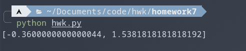
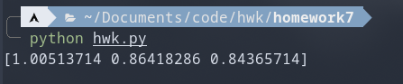
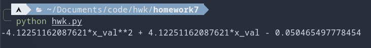
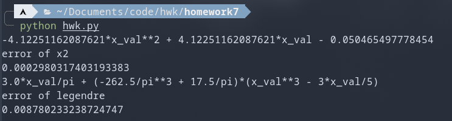
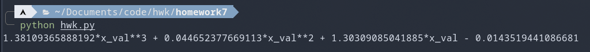
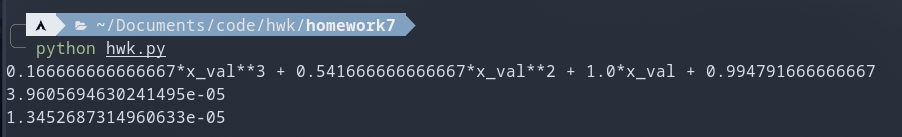
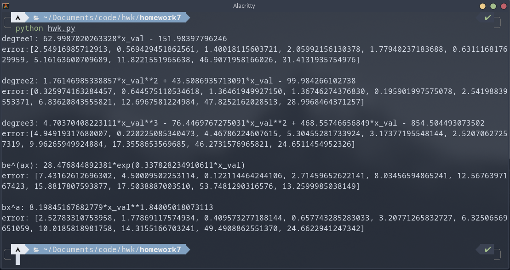
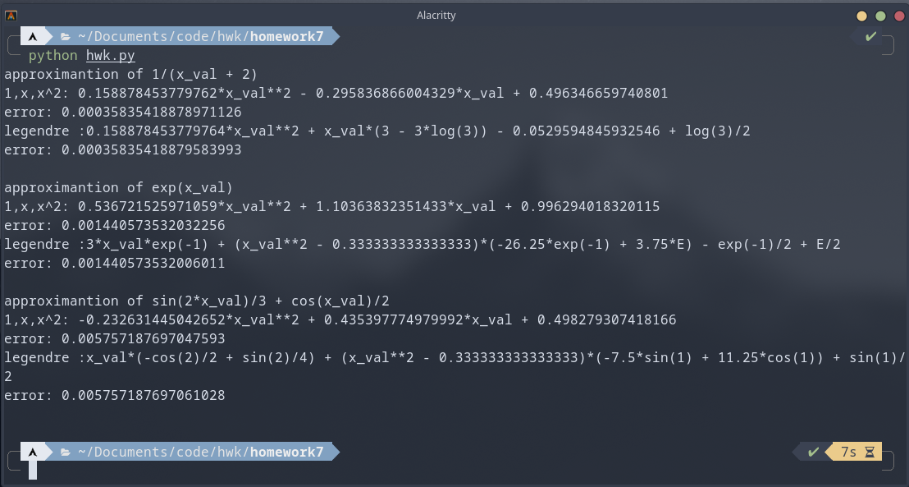
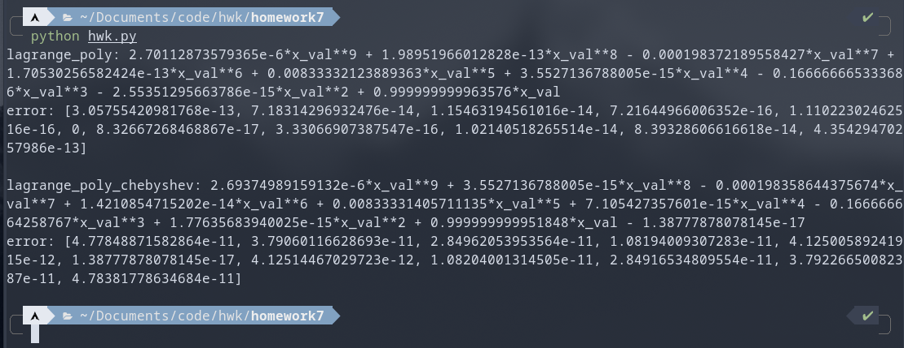
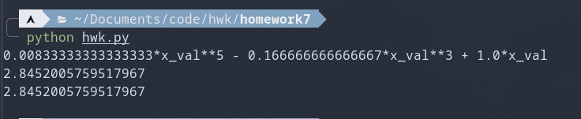

 

### 第八章作业


OS: 						Arch Linux x86_64 
Kernel: 				 5.18.1-arch1-1
Python version:   3.10.4 

注：依赖[sympy](https://www.sympy.org/en/index.html)和[numpy](https://numpy.org/)

### 线性逼近

```python
def linear_ap(x1=[], y1=[]):
    x = deepcopy(x1)
    y = deepcopy(y1)
    xy = 0.0
    x2 = 0.0
    y2 = 0.0
    x_sum = 0.0
    y_sum = 0.0
    for i in range(0, len(x)):
        xy += x[i] * y[i]
        x2 += x[i] * x[i]
        y2 += y[i] * y[i]
        x_sum += x[i]
        y_sum += y[i]
    a0 = (x2 * y_sum - xy * x_sum) / (len(x) * x2 - (x_sum * x_sum))
    a1 = (len(x) * xy - x_sum * y_sum) / (len(x) * x2 - (x_sum * x_sum))
    return [a0, a1]

```

对于书中例子1进行验证

```python
testx = [1, 2, 3, 4, 5, 6, 7, 8, 9, 10]
testy = [1.3, 3.5, 4.2, 5.0, 7.0, 8.8, 10.1, 12.5, 13.0, 15.6]
print(linear_ap(testx, testy))
```



与书中结果一致

### 多项式逼近

```python
def polynomial(x1=[], y1=[], n=3):
    x = deepcopy(x1)
    y = deepcopy(y1)
    a = []
    b = []
    for i in range(0, n + 1):
        a.append([])
        for j in range(0, n + 1):
            a[i].append(0.0)
    for i in range(0, n + 1):
        for j in range(i, i + n + 1):
            temp1 = 0.0
            for k in range(0, len(x)):
                temp1 += x[k] ** j
            a[i][j - i] = temp1

    for i in range(0, n + 1):
        temp1 = 0.0
        for k in range(0, len(x)):
            temp1 += y[k] * (x[k] ** i)
        b.append(temp1)

    res = np.linalg.solve(a, b)
    return res
```

对于书中例2进行验证

```python
testx1 = [0, 0.25, 0.50, 0.75, 1.00]
testy1 = [1, 1.284, 1.6487, 2.117, 2.7183]
print(polynomial(testx1, testy1, 2))
```



与书中结果一致

### 使用基$1$,$x$,$x^2$

```python
def appro_x2(fun=sympy.sin(x_val), min=0.0, max=1.0):
    a = []
    b = []
    for i in range(0, 3):
        a.append([])
        for j in range(0, 3):
            temp1 = sympy.integrate(x_val ** (i + j), (x_val, min, max))
            a[i].append(float(temp1))
        temp = sympy.integrate((x_val**i) * fun, (x_val, min, max))
        b.append(float(temp))
    res1 = np.linalg.solve(a, b)
    res = 0
    for i in range(0, 3):
        res += res1[i] * (x_val**i)
    return res

```

对于书中例1进行验证

```python
funt = sympy.sin(sympy.pi * x_val)
hh = appro_x2(funt, 0.0, 1.0)
print(hh)
```



与书中结果一致

### 勒让德多项式

```python
def legendre_appro(fun=sympy.sin(x_val), min=0.0, max=1.0, n=3):
    legendre_poly = [
        1,
        x_val,
        x_val**2 - (1 / 3),
        x_val**3 - 3 * x_val / 5,
        x_val**4 - 6 * x_val**2 / 7 + 3 / 35,
        x_val**5 - 10 * x_val**3 / 9 + 5 * x_val / 21,
    ]
    a = []
    for i in range(0, n + 1):
        alphaj = sympy.integrate(legendre_poly[i] ** 2, (x_val, min, max))
        temp = sympy.integrate(fun * legendre_poly[i], (x_val, min, max))
        aj = temp / alphaj
        a.append(aj)

    # return a
    res = 0
    for i in range(0, n + 1):
        res += a[i] * legendre_poly[i]
    return res
```

但可惜书中没有相关例子，这我用上面例子验证

```python
funt = sympy.sin(sympy.pi * x_val)
hh = appro_x2(funt, 0.0, 1.0)
print(hh)
print("error of x2")
print(float(error_of_appro(funt, hh, 0.0, 1.0)))

err = legendre_appro(funt, -1.0, 1.0, 3)
print(err)
print("error of legendre")
print(float(error_of_appro(funt, err, -1.0, 1.0)))
```

分别比较上面的误差和了勒让德多项式的误差



误差在可接受范围内

其中误差取的L2
$$
\int_{-1}^{1} |f(x)-g(x)|^2dx
$$

```python
def error_of_appro(fun1=x_val, fun2=x_val, min=0.0, max=1.0):
    res = sympy.integrate((fun1 - fun2) ** 2, (x_val, min, max))
    return res
```

### 切比雪夫拉格朗日多项式

```python
def lagrange_poly(x1=[], y1=[]):
    x = deepcopy(x1)
    y = deepcopy(y1)

    temp = 0.0
    for i in range(0, len(x)):
        temp1 = 1.0
        for j in range(0, len(x)):
            if j != i:
                temp1 = temp1 * (x_val - x[j]) / (x[i] - x[j])
        temp += temp1 * y[i]
    temp = sympy.expand(temp)
    return temp


def lagrange_poly_chebyshev(fun=sympy.sin(x_val), min=0.0, max=1.0, n=10):
    x_zero = []
    y_num = []
    for i in range(1, n + 1):
        temp = sympy.cos((2 * i - 1) * sympy.pi / (2 * n))
        temp = ((max - min) * temp + max + min) / 2
        x_zero.append(float(temp))
        y_num.append(float(fun.subs(x_val, temp)))
    return sympy.expand(lagrange_poly(x_zero, y_num))

```

对于书中例子进行验证

```python
fun_cy = x_val * sympy.exp(x_val)
print(lagrange_poly_chebyshev(fun_cy, 0.0, 1.5, 4))
```



与书中结果一致

### 降次

```python
def maclaurin_app(fun=sympy.sin(x_val), degree=4):
    fundiff = deepcopy(fun)

    parm = []
    parm.append(fun.subs(x_val, 0))
    temppa = 1
    for i in range(1, degree + 1):
        fundiff = sympy.diff(fundiff)
        temppa = temppa / i
        temp = fundiff.subs(x_val, 0) * temppa
        parm.append(temp)

    deg = 0
    for i in range(1, degree + 1):
        if (parm[len(parm) - 1] * 1 / (2**degree - i)) < 0.01:
            deg = i
            break
    res = 0.0
    for i in range(0, len(parm)):
        res = res + parm[i] * (x_val**i)

    for i in range(0, deg):
        zero_of_cy = []
        for j in range(1, degree + 1 - i):
            temp = sympy.cos((2 * j - 1) * sympy.pi / (2 * (degree - i)))
            temp = float(temp)
            zero_of_cy.append(temp)

        cy_pol = 1.0
        for j in range(0, len(zero_of_cy)):
            cy_pol *= x_val - zero_of_cy[j]
        res = res - parm[len(parm) - 1 - i] * cy_pol

    res = sympy.expand(res)
    return res
```

使用书中例子，这里我与标准麦克老林展开做对比

```python
def maclaurin(fun=sympy.sin(x_val), degree=4):
    fundiff = deepcopy(fun)

    parm = []
    parm.append(fun.subs(x_val, 0))
    temppa = 1
    for i in range(1, degree + 1):
        fundiff = sympy.diff(fundiff)
        temppa = temppa / i
        temp = fundiff.subs(x_val, 0) * temppa
        parm.append(temp)
    res = 0.0
    for i in range(0, len(parm)):
        res = res + parm[i] * (x_val**i)
    return res


ans12 = maclaurin_app(sympy.exp(x_val), 4, 0.01)
ans22 = maclaurin(sympy.exp(x_val), 4)
print(ans12)
print(float(error_of_appro(ans12, sympy.exp(x_val), -1, 1)))
print(float(error_of_appro(ans22, sympy.exp(x_val), -1, 1)))
```



可以看出，不仅次数降低，误差也下降

### 题目解答

494.5

```python

def polynomial_ans(x=[], y=[], n=1):
    res = polynomial(x, y, n)
    temp = 0
    for i in range(0, n + 1):
        temp += res[i] * x_val**i

    return temp


def polynomial_error(x=[], y=[], n=1):
    res = polynomial_ans(x, y, n)
    err = []
    for i in range(0, len(x)):
        error = sympy.Abs(res.subs(x_val, x[i]) - y[i])
        err.append(error)
    return err


fivex = [4.0, 4.2, 4.5, 4.7, 5.1, 5.5, 5.9, 6.3, 6.8, 7.1]
fivey = [102.56, 113.18, 130.11, 142.05, 167.53, 195.14, 224.87, 256.73, 229.50, 326.72]
for i in range(1, 4):
    ans1 = polynomial_ans(fivex, fivey, i)
    print("degree" + str(i) + ": " + str(ans1))
    print("error:" + str(polynomial_error(fivex, fivey, i)))
    print()


def linear_ap_ans(x=[], y=[], z=0):
    """
    z=0: be^(ax)
    z=1: bx^a
    other: normal
    """
    lny = []
    lnx = []

    for i in range(0, len(fivey)):
        lny.append(math.log(y[i]))
        lnx.append(math.log(x[i]))

    res = []
    temp = 0
    if z == 0:
        res = linear_ap(x, lny)
        temp = math.exp(res[0]) * sympy.exp(res[1] * x_val)
    elif z == 1:
        res = linear_ap(lnx, lny)
        temp = math.exp(res[0]) * x_val ** (res[1])
    else:
        res = linear_ap(x, y)

    return temp


def linear_ap_error(x=[], y=[], z=0):
    error = []
    res = linear_ap_ans(x, y, z)
    for i in range(0, len(x)):
        temp = sympy.Abs(res.subs(x_val, x[i]) - y[i])
        error.append(temp)
    return error


ans4 = linear_ap_ans(fivex, fivey, 0)
print("be^(ax): " + str(ans4))
print("error: " + str(linear_ap_error(fivex, fivey, 0)))
ans5 = linear_ap_ans(fivex, fivey, 1)
print("bx^a: " + str(ans5))
print("error: " + str(linear_ap_error(fivex, fivey, 1)))
```




506页习题

```python
funthrec = 1 / (x_val + 2)
funthred = sympy.exp(x_val)
funthree = sympy.cos(x_val) / 2 + sympy.sin(2 * x_val) / 3
funthre = [funthrec, funthred, funthree]
for i in range(0, 3):
    ans = appro_x2(funthre[i], -1, 1)
    print("approximantion of " + str(funthre[i]))
    print("1,x,x^2: " + str(ans))
    print("error: " + str(float(error_of_appro(ans, funthre[i], -1, 1))))
    ans1 = legendre_appro(funthre[i], -1, 1, 2)
    print("legendre :" + str(ans1))
    print("error: " + str(float(error_of_appro(ans1, funthre[i], -1, 1))))
    print()
```



516.1

```python
ansla = lagrange_poly(x_of_funoneb, y_of_funoneb)
print("lagrange_poly: " + str(sympy.expand(ansla)))
print("error: " + str(cla_error(ansla, x_of_funoneb, y_of_funoneb)))
print()
anslb = lagrange_poly_chebyshev(funoneb, -1.0, 1.0, 10)
print("lagrange_poly_chebyshev: " + str(sympy.expand(anslb)))
print("error: " + str(cla_error(anslb, x_of_funoneb, y_of_funoneb)))
```



由此可以看出误差很小。

517.7

```python
ans12 = maclaurin_app(sympy.sin(x_val), 6, 0.01)
ans22 = maclaurin(sympy.sin(x_val), 6)
print(ans12)
print(float(error_of_appro(ans12, sympy.exp(x_val), -1, 1)))
print(float(error_of_appro(ans22, sympy.exp(x_val), -1, 1)))
```




代码：

```python
from copy import deepcopy
import numpy as np
import sympy
import math

x_val = sympy.symbols("x_val")


def error_of_appro(fun1=x_val, fun2=x_val, min=0.0, max=1.0):
    res = sympy.integrate((fun1 - fun2) ** 2, (x_val, min, max))
    return res


def linear_ap(x1=[], y1=[]):
    x = deepcopy(x1)
    y = deepcopy(y1)
    xy = 0.0
    x2 = 0.0
    y2 = 0.0
    x_sum = 0.0
    y_sum = 0.0
    for i in range(0, len(x)):
        xy += x[i] * y[i]
        x2 += x[i] * x[i]
        y2 += y[i] * y[i]
        x_sum += x[i]
        y_sum += y[i]
    a0 = (x2 * y_sum - xy * x_sum) / (len(x) * x2 - (x_sum * x_sum))
    a1 = (len(x) * xy - x_sum * y_sum) / (len(x) * x2 - (x_sum * x_sum))
    return [a0, a1]


def polynomial(x1=[], y1=[], n=3):
    x = deepcopy(x1)
    y = deepcopy(y1)
    a = []
    b = []
    for i in range(0, n + 1):
        a.append([])
        for j in range(0, n + 1):
            a[i].append(0.0)
    for i in range(0, n + 1):
        for j in range(i, i + n + 1):
            temp1 = 0.0
            for k in range(0, len(x)):
                temp1 += x[k] ** j
            a[i][j - i] = temp1

    for i in range(0, n + 1):
        temp1 = 0.0
        for k in range(0, len(x)):
            temp1 += y[k] * (x[k] ** i)
        b.append(temp1)

    res = np.linalg.solve(a, b)
    return res


testx = [1, 2, 3, 4, 5, 6, 7, 8, 9, 10]
testy = [1.3, 3.5, 4.2, 5.0, 7.0, 8.8, 10.1, 12.5, 13.0, 15.6]
# print(linear_ap(testx, testy))

testx1 = [0, 0.25, 0.50, 0.75, 1.00]
testy1 = [1, 1.284, 1.6487, 2.117, 2.7183]
# print(polynomial(testx1, testy1, 2))


def polynomial_ans(x=[], y=[], n=1):
    res = polynomial(x, y, n)
    temp = 0
    for i in range(0, n + 1):
        temp += res[i] * x_val**i

    return temp


def polynomial_error(x=[], y=[], n=1):
    res = polynomial_ans(x, y, n)
    err = []
    for i in range(0, len(x)):
        error = sympy.Abs(res.subs(x_val, x[i]) - y[i])
        err.append(error)
    return err


fivex = [4.0, 4.2, 4.5, 4.7, 5.1, 5.5, 5.9, 6.3, 6.8, 7.1]
fivey = [102.56, 113.18, 130.11, 142.05, 167.53, 195.14, 224.87, 256.73, 229.50, 326.72]
# for i in range(1, 4):
#     ans1 = polynomial_ans(fivex, fivey, i)
#     print("degree" + str(i) + ": " + str(ans1))
#     print("error:" + str(polynomial_error(fivex, fivey, i)))
#     print()


def linear_ap_ans(x=[], y=[], z=0):
    """
    z=0: be^(ax)
    z=1: bx^a
    other: normal
    """
    lny = []
    lnx = []

    for i in range(0, len(fivey)):
        lny.append(math.log(y[i]))
        lnx.append(math.log(x[i]))

    res = []
    temp = 0
    if z == 0:
        res = linear_ap(x, lny)
        temp = math.exp(res[0]) * sympy.exp(res[1] * x_val)
    elif z == 1:
        res = linear_ap(lnx, lny)
        temp = math.exp(res[0]) * x_val ** (res[1])
    else:
        res = linear_ap(x, y)

    return temp


def linear_ap_error(x=[], y=[], z=0):
    error = []
    res = linear_ap_ans(x, y, z)
    for i in range(0, len(x)):
        temp = sympy.Abs(res.subs(x_val, x[i]) - y[i])
        error.append(temp)
    return error


ans4 = linear_ap_ans(fivex, fivey, 0)
# print("be^(ax): " + str(ans4))
# print("error: " + str(linear_ap_error(fivex, fivey, 0)))
# print()
ans5 = linear_ap_ans(fivex, fivey, 1)
# print("bx^a: " + str(ans5))
# print("error: " + str(linear_ap_error(fivex, fivey, 1)))


def appro_x2(fun=sympy.sin(x_val), min=0.0, max=1.0):
    a = []
    b = []
    for i in range(0, 3):
        a.append([])
        for j in range(0, 3):
            temp1 = sympy.integrate(x_val ** (i + j), (x_val, min, max))
            a[i].append(float(temp1))
        temp = sympy.integrate((x_val**i) * fun, (x_val, min, max))
        b.append(float(temp))
    res1 = np.linalg.solve(a, b)
    res = 0
    for i in range(0, 3):
        res += res1[i] * (x_val**i)
    return res


# hh = appro_x2(sympy.sin(sympy.pi * x_val), 0.0, 1.0)


def legendre_appro(fun=sympy.sin(x_val), min=0.0, max=1.0, n=3):
    legendre_poly = [
        1,
        x_val,
        x_val**2 - (1 / 3),
        x_val**3 - 3 * x_val / 5,
        x_val**4 - 6 * x_val**2 / 7 + 3 / 35,
        x_val**5 - 10 * x_val**3 / 9 + 5 * x_val / 21,
    ]
    a = []
    for i in range(0, n + 1):
        alphaj = sympy.integrate(legendre_poly[i] ** 2, (x_val, min, max))
        temp = sympy.integrate(fun * legendre_poly[i], (x_val, min, max))
        aj = temp / alphaj
        a.append(aj)

    # return a
    res = 0
    for i in range(0, n + 1):
        res += a[i] * legendre_poly[i]
    return res


funthrec = 1 / (x_val + 2)
funthred = sympy.exp(x_val)
funthree = sympy.cos(x_val) / 2 + sympy.sin(2 * x_val) / 3
funthre = [funthrec, funthred, funthree]
# for i in range(0, 3):
#     ans = appro_x2(funthre[i], -1, 1)
#     print("approximantion of " + str(funthre[i]))
#     print("1,x,x^2: " + str(ans))
#     print("error: " + str(float(error_of_appro(ans, funthre[i], -1, 1))))
#     ans1 = legendre_appro(funthre[i], -1, 1, 2)
#     print("legendre :" + str(ans1))
#     print("error: " + str(float(error_of_appro(ans1, funthre[i], -1, 1))))
#     print()
# def error_of_appro(fun1=x_val, fun2=x_val, min=0.0, max=1.0):
#     res = sympy.integrate((fun1 - fun2) ** 2, (x_val, min, max))
#     return res


# fun1 = sympy.cos(x_val) / 2 + sympy.sin(2 * x_val) / 3
# er = legendre_appro(fun1, -1.0, 1.0, 3)
# print(er)
# print(error_of_appro(er, fun1, -1.0, 1.0))

# funt = sympy.sin(sympy.pi * x_val)
# hh = appro_x2(funt, 0.0, 1.0)
# print(hh)
# print("error of x2")
# print(float(error_of_appro(funt, hh, 0.0, 1.0)))

# err = legendre_appro(funt, -1.0, 1.0, 3)
# print(err)
# print("error of legendre")
# print(float(error_of_appro(funt, err, -1.0, 1.0)))


def lagrange_poly(x1=[], y1=[]):
    x = deepcopy(x1)
    y = deepcopy(y1)

    temp = 0.0
    for i in range(0, len(x)):
        temp1 = 1.0
        for j in range(0, len(x)):
            if j != i:
                temp1 = temp1 * (x_val - x[j]) / (x[i] - x[j])
        temp += temp1 * y[i]
    temp = sympy.expand(temp)
    return temp


# x_node = [0, 0.5, 1, 1.5]
# y_node = [0, 0.824361, 2.71828, 6.72253]

# print(lagrange_poly(x_node, y_node))


def lagrange_poly_chebyshev(fun=sympy.sin(x_val), min=0.0, max=1.0, n=10):
    x_zero = []
    y_num = []
    for i in range(1, n + 1):
        temp = sympy.cos((2 * i - 1) * sympy.pi / (2 * n))
        temp = ((max - min) * temp + max + min) / 2
        x_zero.append(float(temp))
        y_num.append(float(fun.subs(x_val, temp)))
    return sympy.expand(lagrange_poly(x_zero, y_num))


# fun_cy = x_val * sympy.exp(x_val)
# print(lagrange_poly_chebyshev(fun_cy, 0.0, 1.5, 4))
funoneb = sympy.sin(x_val)
# print(lagrange_poly_chebyshev(funoneb, -1.0, 1.0, 4))
x_of_funoneb = []
y_of_funoneb = []
for i in range(0, 11):
    temp = -1 + i * 0.2
    x_of_funoneb.append(temp)
    y_of_funoneb.append(funoneb.subs(x_val, temp))

# print(x_of_funoneb)
# print(y_of_funoneb)


def cla_error(fun_app=x_val, x=[], y=[]):
    error = []
    for i in range(0, len(x)):
        temp = sympy.Abs(fun_app.subs(x_val, x[i]) - y[i])
        error.append(temp)
    return error


# ansla = lagrange_poly(x_of_funoneb, y_of_funoneb)
# print("lagrange_poly: " + str(sympy.expand(ansla)))
# print("error: " + str(cla_error(ansla, x_of_funoneb, y_of_funoneb)))
# print()
# anslb = lagrange_poly_chebyshev(funoneb, -1.0, 1.0, 10)
# print("lagrange_poly_chebyshev: " + str(sympy.expand(anslb)))
# print("error: " + str(cla_error(anslb, x_of_funoneb, y_of_funoneb)))
def maclaurin_app(fun=sympy.sin(x_val), degree=4, tol=0.01):
    fundiff = deepcopy(fun)

    parm = []
    parm.append(fun.subs(x_val, 0))
    temppa = 1
    for i in range(1, degree + 1):
        fundiff = sympy.diff(fundiff)
        temppa = temppa / i
        temp = fundiff.subs(x_val, 0) * temppa
        parm.append(temp)

    deg = 0
    for i in range(1, degree + 1):
        if (parm[len(parm) - 1] * 1 / (2**degree - i)) < tol:
            deg = i
            break
        if i == degree:
            print("error")
            return

    res = 0.0
    for i in range(0, len(parm)):
        res = res + parm[i] * (x_val**i)

    for i in range(0, deg):
        zero_of_cy = []
        for j in range(1, degree + 1 - i):
            temp = sympy.cos((2 * j - 1) * sympy.pi / (2 * (degree - i)))
            temp = float(temp)
            zero_of_cy.append(temp)

        cy_pol = 1.0
        for j in range(0, len(zero_of_cy)):
            cy_pol *= x_val - zero_of_cy[j]
        res = res - parm[len(parm) - 1 - i] * cy_pol

    res = sympy.expand(res)
    return res


def maclaurin(fun=sympy.sin(x_val), degree=4):
    fundiff = deepcopy(fun)

    parm = []
    parm.append(fun.subs(x_val, 0))
    temppa = 1
    for i in range(1, degree + 1):
        fundiff = sympy.diff(fundiff)
        temppa = temppa / i
        temp = fundiff.subs(x_val, 0) * temppa
        parm.append(temp)
    res = 0.0
    for i in range(0, len(parm)):
        res = res + parm[i] * (x_val**i)
    return res


# ans12 = maclaurin_app(sympy.exp(x_val), 4, 0.01)
# ans22 = maclaurin(sympy.exp(x_val), 4)
# print(ans12)
# print(float(error_of_appro(ans12, sympy.exp(x_val), -1, 1)))
# print(float(error_of_appro(ans22, sympy.exp(x_val), -1, 1)))
ans12 = maclaurin_app(sympy.sin(x_val), 6, 0.01)
ans22 = maclaurin(sympy.sin(x_val), 6)
print(ans12)
print(float(error_of_appro(ans12, sympy.exp(x_val), -1, 1)))
print(float(error_of_appro(ans22, sympy.exp(x_val), -1, 1)))

```

